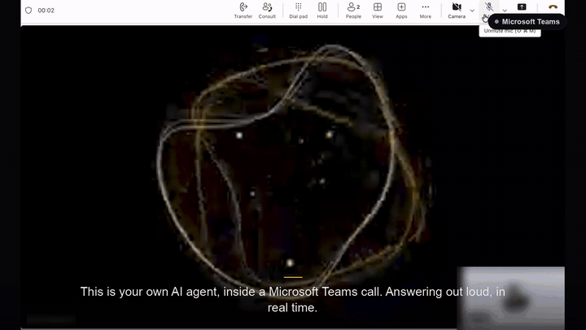
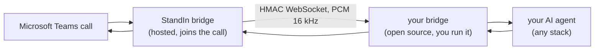

# StandIn

### Your AI teammate in Microsoft Teams calls

Put your own AI agent into a Microsoft Teams call as a real participant, in your own tenant. It answers and places calls, sees the caller's camera and screen-share, converses in real time, and appears as a lip-synced avatar. Free sandbox, no Azure bot, no card.

[**Try it free**](https://standin.komaa.com) &nbsp;·&nbsp; [**Documentation**](https://docs.komaa.com) &nbsp;·&nbsp; [**Quickstart**](https://docs.komaa.com/quickstart)

---

## Demo

A 90-second walkthrough: set up StandIn on OpenClaw, then a real Microsoft Teams call where the agent answers, sees the shared screen, speaks when addressed, and appears as a lip-synced avatar on its tile. [Watch the full video with audio](https://github.com/komaa-com/standin/blob/main/assets/standin-demo.mp4).

## What it does

- **Listens and talks back** in real time, inside the ~200 ms window a live conversation needs, and stops the moment it is interrupted.
- **Sees the meeting**: continuous vision over screen-share and camera, with per-participant attribution, so "what do you make of this?" just works.
- **Speaks only when addressed**: stays silent in a group call until called by name, then steps in and steps back.
- **Governed by default**: recording-consent gating, a closed-by-default allowlist, and signed, encrypted media.

It joins under your own Microsoft identity, and no meeting recordings are stored.

## Bring your own agent

StandIn is the hosted bridge that joins the Teams call and handles the media and avatar rendering. You bring the brain. A small open-source bridge connects your existing agent, whatever stack it runs on, so it answers Teams calls with no Teams SDK, no Microsoft Graph, and no media infrastructure to run.

Seven backends, published on npm and PyPI:

| Backend | What it connects | Package |
|---|---|---|
| **OpenClaw** | The OpenClaw framework, as a plugin |  |
| **Hermes** | The Hermes Agent, as a plugin |  |
| **ElevenLabs** | A hosted ElevenLabs Agent |   |
| **LiveKit** | Any LiveKit Agent, including avatar agents |   |
| **OpenAI** | OpenAI Realtime (`gpt-realtime`) |  |
| **Deepgram** | A Deepgram Voice Agent |   |
| **Cartesia** | A Cartesia Line voice agent |  |

The Node and Python packages are interchangeable behind one wire contract, so you can switch backends without rewriting your integration.

## Quickstart

1. Get a free identity at [standin.komaa.com](https://standin.komaa.com). No Azure bot, no card.
2. Connect your own Azure bot and pick the backend that matches your stack from the table above.
3. Follow its guide on [docs.komaa.com](https://docs.komaa.com), point your StandIn identity at the bridge, and place a call.

## How it works

The hosted bridge joins the meeting, captures media, and renders the avatar. Your bridge is a small, dependency-light service that terminates an HMAC-authenticated WebSocket on one side and your agent platform on the other. Audio is 16 kHz PCM; the transport is replay-proof and recording-gated.

## The three CVI pillars

A Teams call becomes a true two-way video conversation:

- **Perception**: the agent sees the caller's camera and screen-share, on demand or continuously.
- **Dialogue**: realtime speech-to-speech or streaming STT to agent to TTS, with barge-in and group-call etiquette.
- **Rendering**: a lip-synced animated avatar tile, with expression cues and picture-in-picture image sharing.

## Links

- Website: [standin.komaa.com](https://standin.komaa.com)
- Docs: [docs.komaa.com](https://docs.komaa.com)

---

StandIn is independent software. It is not affiliated with, endorsed by, or sponsored by Microsoft. Microsoft and Microsoft Teams are trademarks of the Microsoft group of companies.

