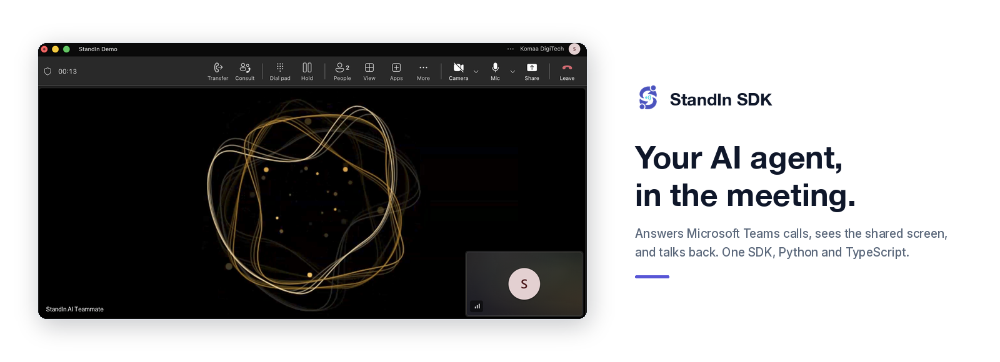
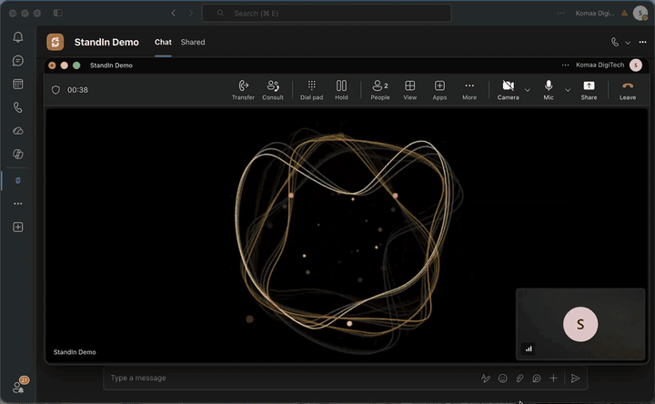

<p align="center">
  
</p>

<h1 align="center">StandIn SDK</h1>

<p align="center">
  <a href="#about">About</a> &nbsp;·&nbsp;
  <a href="#how-it-works">How It Works</a> &nbsp;·&nbsp;
  <a href="#quickstart">Quickstart</a> &nbsp;·&nbsp;
  <a href="#plugins">Plugins</a> &nbsp;·&nbsp;
  <a href="#agent-skills">Agent Skills</a> &nbsp;·&nbsp;
  <a href="#documentation">Documentation</a>
</p>

---

## About

**StandIn** is the open-source SDK that gives your AI agent a seat in Microsoft Teams. It answers calls,
joins meetings, sees the shared screen, and replies in chat, as a real participant in your own tenant.

You build the agent. StandIn handles everything between it and Microsoft Teams: joining the call, the Microsoft
side, the media, and the avatar tile. There is no Microsoft Teams SDK to learn, no Graph API, and no media
infrastructure to run.

- **Build** with one API in Python or TypeScript. Same surface, same contract, at parity.
- **Connect** what you already run: ElevenLabs, Deepgram, Cartesia, OpenAI, LiveKit, Hermes
  Agent, OpenClaw, or your own agent in about 80 lines.
- **Try** it before writing any agent code. The built-in echo answers a real call and sends your own
  voice back.

## How It Works

Three parts, and you only write the last one.

| | |
|---|---|
| **StandIn** | Joins the Microsoft Teams call and owns the Microsoft side: the bot identity, the media, and the avatar tile the caller sees. |
| **This SDK** | Runs in your worker. It answers StandIn's connection, keeps the call healthy, and hands you the caller's voice. |
| **Your agent** | Replies. Bring a framework you already run, or write a handler yourself. |

```text
   Microsoft Teams  <-->  StandIn  <-->  your worker  <-->  your agent
```

The SDK is the transport. Speech recognition, speech generation and reasoning stay with your framework
or provider, so you keep the brain and StandIn never sees your model keys.

What it does so you do not have to: authenticate the connection, keep one live call per caller, pace the
audio in both directions, stop the agent talking over someone who interrupts, and shut down cleanly when
a call ends or a provider fails.

It also gives your agent the things that belong to being on a call rather than to any provider, so each
plugin gets them without writing them again:

| | |
|---|---|
| **Call tools** | Hang up, react with an expression, put an image on the bot's tile, look at the shared screen, look back at one already gone. Declared once and rendered into whichever JSON your provider wants. |
| **Vision and display** | Frames from the caller's camera and screen share, a vision budget, a recording-gated keyframe history, and images or documents drawn onto the bot's own tile. |
| **Consultation** | Delegate real work to a slower agent without stalling the call, and durable background tasks whose promised result survives a restart. |
| **Meeting recap** | A bounded transcript of what was said and what was shown, written up as minutes and posted to the chat, with a Word document beside it. |
| **Outbound calling** | Place a call, park what to say until it is answered, and fall back to chat when nobody picks up. Speak into a call that is already up instead of ringing somebody twice. |
| **Turn-taking** | Utterance segmentation, paced playback and barge-in, composed into one lane so an agent that only reads and writes text can hold a phone call. |
| **Lip-sync and expression** | A viseme timeline estimated from the text and spread over the audio actually sent, for Latin and Arabic, plus an emotion cue that costs no extra model call. |
| **Checking the install** | Ring your own worker on loopback and report what worked, with no provider bill, no tunnel and no Microsoft tenant. |

The [documentation](https://docs.komaa.com) covers the wire protocol and audio format when you need them.

## Quickstart

The built-in **echo** plugin answers a real Microsoft Teams call and sends your voice back, so you can prove
the connection before adding an agent. It needs no framework and no API key.

```bash
python3 -m venv .venv
source .venv/bin/activate
pip install standin-sdk

export STANDIN_SECRET="your-StandIn-connection-secret"
python -m standin.plugins.echo
```

Or in TypeScript, the same echo, the same wire protocol:

```bash
npm install @komaa/standin-sdk

export STANDIN_SECRET="your-StandIn-connection-secret"
npx standin-echo
```

Create an identity at [standin.komaa.com](https://standin.komaa.com), expose port `9442` through a tunnel
or ingress, and register the public `wss://` URL with the `/msteams/calling` path as that identity's
agent voice URL. Then call it from Microsoft Teams and hear yourself.

Once that works, swap the echo for your agent. The whole contract is seven callbacks, and you implement only
the ones you need.

**Python**

```python
from standin import CallServer, CallSession


class MyAgent:
    async def on_start(self, session: CallSession) -> None:
        self._call = session

    async def on_caller_audio(self, pcm: bytes) -> None:
        await self._call.send_audio(await my_framework.respond(pcm))   # your agent


server = CallServer(handler_factory=MyAgent)
await server.start()
```

**TypeScript**

```ts
import { CallServer, type CallSession } from "@komaa/standin-sdk";

class MyAgent {
  #call!: CallSession;

  async onStart(session: CallSession) {
    this.#call = session;
  }

  async onCallerAudio(pcm: Buffer) {
    await this.#call.sendAudio(await myFramework.respond(pcm)); // your agent
  }
}

await new CallServer({ handlerFactory: () => new MyAgent() }).start();
```

## Plugins

Every plugin ships inside the one package, so a new capability lands once and all of them get
it. Each one lives in `libraries/python/standin/plugins/` or
`libraries/typescript/src/plugins/`, and has a runnable example under [examples/](examples).

| Your agent | Python | TypeScript | Example |
|---|---|---|---|
| [ElevenLabs](https://elevenlabs.io/docs/agents-platform/overview) | yes | yes | [elevenlabs-msteams-connector](examples/elevenlabs-msteams-connector) |
| [Deepgram](https://developers.deepgram.com/docs/voice-agent) | yes | yes | [deepgram-msteams-connector](examples/deepgram-msteams-connector) |
| [Cartesia](https://docs.cartesia.ai/line) | yes | yes | [cartesia-msteams-connector](examples/cartesia-msteams-connector) |
| [OpenAI Realtime](https://platform.openai.com/docs/guides/realtime) | | yes | [openai-msteams-connector](examples/openai-msteams-connector) |
| [LiveKit](https://docs.livekit.io/agents/) | yes | yes | [livekit-msteams-connector](examples/livekit-msteams-connector) |
| [Hermes Agent](https://github.com/NousResearch/hermes-agent) | yes | | [hermes-msteams-connector](examples/hermes-msteams-connector) |
| [OpenClaw](https://openclaw.ai) | | yes | [openclaw-msteams-connector](examples/openclaw-msteams-connector) |
| Your own | yes | yes | [Python echo](libraries/python/standin/plugins/echo), [TypeScript echo](libraries/typescript/src/plugins/echo) |

Most of them cost nothing to install. ElevenLabs, Deepgram and Cartesia are reached over an
ordinary WebSocket in both languages, and OpenAI Realtime the same way in TypeScript, so they
are already there after `pip install standin-sdk` or `npm install @komaa/standin-sdk`, with no
extra dependency at all.

Only a plugin that runs a framework **inside** your process asks for more, and it says so in
one line: `pip install "standin-sdk[livekit]"` or `pip install "standin-sdk[hermes-agent]"` in
Python, or the optional peer packages named by the plugin in TypeScript.

Missing yours? Adding one is a copy of the echo plugin plus a few lines of glue. See
[CONTRIBUTING.md](CONTRIBUTING.md).

## Agent Skills

A coding agent can install these and wire StandIn for you: connection secret, OpenClaw,
Hermes Agent, and publishing `/msteams/calling`.

```bash
npx skills add komaa-com/skills
```

| Skill | What it teaches the agent |
|---|---|
| [setup-standin](https://github.com/komaa-com/skills/tree/main/setup-standin) | Get a StandIn connection from the portal and install the SDK. |
| [standin-openclaw](https://github.com/komaa-com/skills/tree/main/standin-openclaw) | Load the OpenClaw plugin (`standin-msteams`) and merge `openclaw.json`. |
| [standin-hermes-agent](https://github.com/komaa-com/skills/tree/main/standin-hermes-agent) | Enable the Hermes Agent plugin and serve the call listener. |
| [expose-standin](https://github.com/komaa-com/skills/tree/main/expose-standin) | Publish `/msteams/calling`, probe the mount, and register the agent calling URL. |

Install one skill with `npx skills add komaa-com/skills --skill standin-openclaw`.
The skills live in [komaa-com/skills](https://github.com/komaa-com/skills), not in this repository.

## Documentation

Full guides, the call handler reference, the audio and chat lanes, and the security model live at
**[docs.komaa.com](https://docs.komaa.com)**.

## Demo



A real Microsoft Teams call: the agent answers, sees the shared screen, speaks when addressed, and appears as a
lip-synced avatar.

## Contributing

Issues and pull requests are welcome, and a new plugin is the most useful thing you can add.
`make check` needs no API keys, no Microsoft tenant and no StandIn account, so a pull request from a fork
passes CI without any secrets. See [CONTRIBUTING.md](CONTRIBUTING.md).

## License

[MIT](LICENSE), copyright 2026 Komaa DigiTech.

StandIn is independent software. It is not affiliated with, endorsed by, or sponsored by Microsoft.
Microsoft and Microsoft Teams are trademarks of the Microsoft group of companies.
