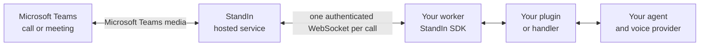

Joining a Microsoft Teams call means speaking Microsoft's own real-time media protocol. **You do not have to.** It is StandIn, a hosted service at [standin.komaa.com](https://standin.komaa.com). You run a
worker, and the SDK is the other end of the socket StandIn dials.

## Three responsibilities, three owners

| Owner | Responsibility |
|---|---|
| **StandIn** (hosted) | Joins the Microsoft Teams call, owns the bot registration, Graph, and media negotiation. Dials your worker once per call. Places the reply audio back into the call. |
| **The SDK** (`CallServer`) | The socket StandIn dials, the HMAC handshake and its single-use replay guard, capacity, draining, the wire protocol, outbound sequence numbers and the audio timeline, five bounds on a call that nobody closes, and idempotent teardown. |
| **Your plugin** | What to do with the caller's voice, and where the reply comes from. The recognizer, the model and the voice are yours; everything between them and the wire is already in the SDK. |

That split is why a plugin is small. The echo plugin answers a real Microsoft Teams call in under a hundred
lines, and it is not a toy: it is the same shape every plugin keeps.

## The seam

A handler implements as many of **seven callbacks** as it needs. All of them are optional, a missing
one is a no-op, and nothing inherits from anything. The names are `snake_case` in Python and
`camelCase` in TypeScript and are otherwise identical.

| Method | When the server calls it |
|---|---|
| `on_start(session)` / `onStart(session)` | The call is live. Join a room, open a realtime socket, build an agent. Audio does not flow until this returns, so a slow start delays the caller rather than dropping frames. |
| `on_caller_audio(pcm)` / `onCallerAudio(pcm)` | One frame of the caller's voice. On the receive path of a live call, so it must not block. Truncated or malformed payloads never reach here. |
| `on_context(text)` / `onContext(text)` | Non-interrupting context as a plain sentence ready to put in front of a model: participant counts and group etiquette, DTMF key presses, recording status changes. |
| `on_video_frame(frame)` / `onVideoFrame(frame)` | One sampled frame of the caller's camera or screen share. Sparse and best-effort, not a video stream. Most plugins want `latest_video_frame()` instead and let the server keep the newest frame for them. |
| `on_speaker_change(name)` / `onSpeakerChange(name)` | A different person started speaking. Only ever called when StandIn sends unmixed audio, and on change only: the name rides every inbound audio frame, so at 20 ms a frame a per-frame callback would tell a model who is talking fifty times a second and it would hear nothing else. |
| `on_goodbye(text)` / `onGoodbye(text)` | StandIn is ending the call and wants this line spoken first. Interrupt the current turn and say it: a goodbye queued behind a long answer is one the caller never hears. |
| `aclose(reason)` | Release everything this call holds. Called exactly once, on every path including cancellation, before the slot is freed. |

An exception raised from any of them is logged and ends that call alone. One bad call must never
take the worker with it.

<Note>
**Where the two languages put the last two.** TypeScript declares all seven on `CallHandler`, every
one optional. Python declares five on `CallHandler` and keeps `on_video_frame` and
`on_speaker_change` on two separate protocols, `VideoHandler` and `SpeakerHandler`. The reason is
mechanical: Python's `CallHandler` is `runtime_checkable`, and a runtime check demands every member
the protocol declares, so a sixth method there would make `isinstance(handler, CallHandler)` fail for
every handler written before the vision lane existed. The server duck-types both, through the same
guarded dispatch as the other five, so **implementing the method is enough** and inheriting from
anything is never required.
</Note>

## What the call gives back

`CallSession` is the handler's only way to reach the socket. The handler seam is narrow; the session
is wide, and the same seventeen members are on it in both languages.

**What you read.**

| Member | What it is |
|---|---|
| `.call_id` / `.callId` | StandIn's id for this call. Authenticated: it is the value the handshake HMAC signed, not something a caller supplied. |
| `.start` | The `session.start` that opened the call: caller identity, direction, thread, recording status. |
| `.recording_active` / `.recordingActive` | Whether this call is being recorded, right now. One flag the server keeps current. |
| `.speaker` | Who is speaking, when StandIn sends unmixed audio. Empty on the mixed path (`None` in Python, `undefined` in TypeScript), which is most calls, so treat it as a hint rather than something to depend on. |
| `.participant_count` / `.participantCount` | How many people are on the call. The number behind the group-etiquette context sentences, for a plugin that would rather branch than hand a sentence to a model. |
| `.answered` | Whether anything has actually taken this call yet. |
| `.buffered_bytes` / `.bufferedBytes` | How much outbound data the socket has not flushed. The number a continuous sender watches before pushing another frame. Zero means no evidence of backpressure, not proof of an idle socket. |
| `.media_time_ms` / `.mediaTimeMs` | The outbound audio timeline in milliseconds, and the clock a video frame must be stamped with. A wall clock keeps ticking through listening silence while this one does not, so stamping video from a wall clock makes the two drift apart on paper even when they are in step. |

**What you act with.**

| Member | What it does |
|---|---|
| `send_audio(pcm)` / `sendAudio(pcm)` | Send the agent's voice. The server owns the sequence number and the outbound timeline, so a swapped audio source cannot make timestamps jump backwards. Sending audio also marks the call answered. |
| `cancel_playback()` / `cancelPlayback()` | Drop whatever agent audio StandIn still has buffered. |
| `mark_answered()` / `markAnswered()` | Say that an agent has taken the call, for an agent that joins and listens before it speaks. Stamped once, never re-stamped. This is what the unanswered-call reaper below watches. |
| `latest_video_frame(source)` / `latestVideoFrame(source)` | The newest frame the caller showed, or nothing. Synchronous: it reads what the frame loop already stored. With no `source` the screen share wins over the camera, because an agent asked to look is nearly always being asked about what is being shown. See [Vision and the avatar](/python-sdk/vision). |
| `display_image(...)` / `displayImage(...)` | Draw an image on the bot's tile for a few seconds: a chart it just computed, a page it is quoting. |
| `send_tile_frame(jpeg)` / `sendTileFrame(jpeg)` | Put one frame of continuous video on the tile, for a worker that produces video of its own. Latest wins, there is no handshake, and `TileStream` is what paces it. |
| `express(emotion)` | Hint the emotion the avatar should wear. Best-effort and video only: an unknown emotion renders as neutral. |
| `send_speech_marks(marks)` / `sendSpeechMarks(marks)` | The viseme timeline for one utterance, which is what drives lip-sync. See [The avatar](/python-sdk/avatar). |
| `end(reason)` | End the call. Idempotent, and the first reason wins, so a cascade of close causes cannot overwrite the one that actually ended it. |

<Note>
**The SDK sends the hints and receives the frames. StandIn draws the tile.** `express`,
`send_speech_marks`, `display_image` and `send_tile_frame` go out; `latest_video_frame` and
`on_video_frame` come in. How the face is rendered from those hints is the service's business, and
nothing in your worker needs to know it. Everything on that lane is additive and best-effort: a
service that does not implement one of these ignores it rather than failing the call, and none of it
changes a sample of what the caller hears.
</Note>

<Warning>
**Gate storage on `recording_active` / `recordingActive`, not on a sentence you remember seeing.**
Anything that stores or ships what the caller said or showed to a third party belongs behind this
flag. The server starts it from the `session.start` snapshot and then follows every later recording
status change, and **a reported change wins over the snapshot whichever arrives first**. An omitted
snapshot field means the state was unknown at answer time, not "not recording": letting the snapshot
overwrite a status that landed first would silently shut every recording-gated capability for the
whole call. A recorded call is one the caller was told is being kept. An unrecorded one is not.
</Warning>

<Warning>
**`cancel_playback()` is the only lever that un-sends audio already handed to the service.** Call it
the moment your provider reports the caller started speaking, and call it **before** you cancel the
response upstream. Without it a barge-in stops the model but the bot keeps talking for the length of
the buffered PCM, which is the single most common "it ignores me when I interrupt" report.
</Warning>

<Tip>
`end()` is safe to call from inside `on_start`, which is how a plugin refuses a call it does not
want. It returns immediately there, and the close runs once `on_start` unwinds.
</Tip>

## Audio, and why the helpers are in the SDK

The wire is **PCM16, 16 kHz, mono, little-endian**, in both directions. Almost nothing else is. The
realtime speech-to-speech models speak 24 kHz, most TTS vendors emit 22.05 or 24 kHz, and none of
them chunk on the wire's frame boundary.

So every plugin that is not a pure passthrough ends up writing the same two things: a
resampler, because the rates differ, and a frame aligner, because a resampled buffer does not divide
evenly into the wire's 640-byte frame, and dropping the remainder clips the end of every turn.

Both live in the SDK, in both languages, because they are properties of the **wire**, not of any
framework. They are dependency-free on purpose: speech at these rates does not need a windowed-sinc
filter, and the alternative is putting numpy or scipy on the critical path of every audio frame of
every call.

| Constant | Value |
|---|---|
| `SAMPLE_RATE_HZ` | `16000` |
| `REALTIME_SAMPLE_RATE_HZ` | `24000` |
| `FRAME_MS` | `20` |
| `FRAME_BYTES` | `640` |
| `BYTES_PER_SAMPLE` | `2` |
| `NUM_CHANNELS` | `1` |

Helpers: `resample_pcm16` / `resamplePcm16`, `frame_duration_ms` / `frameDurationMs`, and
`FrameAligner` with `push`, `flush`, `reset` and `pending`.

## Two lanes

Calls and chat are separate sockets with opposite directions, and that difference decides what you
have to expose.

| Lane | Who dials | Transport | What you expose |
|---|---|---|---|
| Calls | StandIn dials your worker | WebSocket, one per call, at `/msteams/calling/{callId}` | port `9442` by default, published over HTTPS |
| Chat | your worker dials StandIn | one long-lived WebSocket | nothing |

Because the chat lane is dialed out, Microsoft Teams chat needs no listener, no open port and no tunnel, and
your agent never holds a Bot Framework credential. StandIn owns the Microsoft Teams bot, authenticates the
activity, resolves it to your connection, and strips the bot @mention before your handler sees the
text.

Both lanes authenticate with your connection secret. One key covers both, and that is the usual
case. The chat lane reads `STANDIN_CHAT_SECRET` first and falls back to `STANDIN_SECRET`, so a
deployment that issued a separate key for chat sets the extra variable and changes nothing else.

`ChatChannel`, `InboundMessage`, `parse_inbound` / `parseInbound`, `build_reply` / `buildReply`,
`PersonalChats` and `SCHEMA_VERSION` are in both SDKs. Two names differ, and each one is a
first-line failure if you assume otherwise:

- **The personal-or-group branch.** Python reads it off the message as the `msg.is_personal`
  property. TypeScript exports `isPersonal(msg)` as a free function.
- **`DEFAULT_CHAT_URL` is at the TypeScript barrel and not the Python one.** Python keeps it in the
  module, so it is `from standin.chat import DEFAULT_CHAT_URL`, not `from standin import ...`.
  Neither is usually needed: `ChatChannel` already falls back to it, and `STANDIN_CHAT_URL`
  overrides it.

<Warning>
`build_reply` / `buildReply` echoes `tenantId` and `conversationId` from the inbound message
**exactly**. StandIn rejects a mismatch, and that check is the cross-tenant leak guard the whole
relay rests on. It echoes `bindingId` too when the inbound message carries one, for the same reason
one level down: a single tenant can hold several connections, so the tenant alone no longer says
which one a reply is from. Do not construct a reply payload by hand.
</Warning>

## Authentication

There are three signing helpers, not two. They sign different things, they carry different freshness
windows, and none is a substitute for another. The names below are the Python ones; TypeScript has
the same three in `camelCase`.

| | v1 handshake | v1 body | v2 request |
|---|---|---|---|
| Functions | `sign_handshake` / `verify_handshake` | `sign_body` / `verify_body` | `canonical_request` and `sign_request` |
| Signs | `"{timestampMs}.{id}"` | `"{timestampMs}.{rawBody}"`, the exact transmitted bytes | `"METHOD\npath\nsha256_hex(body)"`, so the method and the route are inside the signature, not only the bytes |
| Freshness window | 60 s (`REPLAY_WINDOW_MS`) | 300 s (`CHAT_REPLAY_WINDOW_MS`) | 60 s where the SDK verifies it |
| Used by | both WebSocket lanes. The signed id is the call id on the call lane and the channel name on the chat lane | a POST relay that wants the payload itself protected. Exported for your own use; no lane in the SDK runs it | the outbound place-call request the SDK sends, and the call-outcome route it verifies |

Headers are `X-StandIn-Timestamp`, `X-StandIn-Signature` and `X-StandIn-Signature-V2`. Verification
fails closed on empty input, and each handshake is single-use, so a replayed upgrade is rejected
even inside its window.

<Tip>
Sign the exact bytes you will transmit. Parsing JSON and re-serializing it can change whitespace,
key order or Unicode escaping, and any one of those turns a valid signature into a rejection nobody
can explain from the payload alone.
</Tip>

<Warning>
The secret in your worker must **byte-match** the one registered in StandIn, or the handshake fails
and no call connects. It fails silently by design: an endpoint that explains why it rejected you is
an endpoint that helps an attacker, so budget for reading the value rather than for reading an error
message. The same is true one lane over: a chat channel signing with the wrong key gets no
explanation either, which is why `STANDIN_CHAT_SECRET` is worth checking whenever chat is the half
that is quiet.
</Warning>

## Capacity and the watchdogs

`CallServer` refuses work rather than degrading under it. There are 64 slots by default
(`max_connections` / `maxConnections`), and a dial that arrives while the server is draining, or
when every slot is taken, gets `503`. Both checks run **before any signature is verified**, so a
flood cannot make the worker spend CPU on crypto for calls it was never going to accept, and a
worker that is winding down stops taking calls it will never finish. Five bounds then sit on a call
that nobody closes, four of them on by default:

| Bound | Option | Default | What it catches |
|---|---|---|---|
| pre-start | `pre_start_timeout` / `preStartTimeoutMs` | 10 s | a socket that authenticated and then never sent `session.start` |
| `on_start` | `on_start_timeout` / `onStartTimeoutMs` | 15 s | a handler whose startup hangs, so the caller is not left in silence |
| audio idle | `audio_idle_timeout` / `audioIdleTimeoutMs` | 45 s | a live call that stopped carrying caller audio |
| unanswered-call reaper | `stale_call_reaper_seconds` / `staleCallReaperMs` | 120 s, on | a call **nothing ever answered**. Closes with `no-agent-answered` |
| per-call ceiling | `max_call_seconds` / `maxCallMs` | 0, off | a call that is still going and has no reason to stop. Closes with `call-duration-limit` |

<Note>
**The reaper is the one none of the other three catch.** An agent dispatch that never lands leaves
`session.start` delivered, `on_start` returned, and the caller still talking, so the pre-start, the
`on_start` timeout and the audio-idle watchdog are each satisfied while the caller sits on a live
call hearing nothing. **Answered** means audio went out: `send_audio` marks it for you, so every
plugin is covered without writing anything. `mark_answered()` exists for the agent that joins and
listens first, and a plugin that joins a room should call it when the agent's own audio track
appears, not when a participant connects. Monitors, recorders and avatar workers all connect, and
none of them is an agent answering.
</Note>

The ceiling is the polite one. Set `max_call_seconds` and the server flushes playback, speaks
`goodbye_text` through the handler's own `on_goodbye`, allows `goodbye_grace` (6 s by default) for
it to finish, and then closes. The goodbye goes through the callback StandIn's own closing line
already uses, so no plugin needs new code to honour it.

Teardown is idempotent and shielded, and always frees the slot.

## Microsoft Graph permissions

Bringing your own Microsoft Teams bot means registering an Entra app and an Azure Bot resource in your tenant,
admin-consenting the application permissions, and pointing its calling webhook at StandIn. See the
canonical [Graph permissions table](/teams/azure-bot#8-grant-graph-permissions).

## The protocol is generated

`protocol/schema.yaml` in the repository is the single source of truth for the wire. Both SDKs'
protocol modules are generated from it and gated against drift, and shared conformance vectors
assert that Python and TypeScript produce byte-identical payloads. Neither module is hand-edited,
which is why the two languages cannot quietly diverge.
