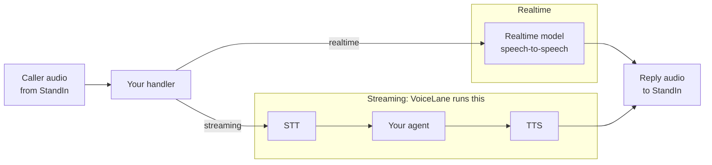

The SDK carries audio and it has **no mode setting**. Nothing you configure selects a mode: the
shape of the middle is decided by which provider you hand the audio to, and you can change your mind
without touching the seam.

What the SDK does bring is the middle itself, for one of the two shapes. It contains no recognizer,
no voice and no model, and it never will. It does contain the assembly that runs yours.

<CardGroup cols={2}>
  <Card title="Realtime" icon="bolt">
    **Speech-to-speech.** Caller audio goes straight to a realtime model, and the model's audio comes
    straight back. Lowest latency, natural turn-taking. Needs a realtime provider key. The
    turn-taking is the provider's, so the SDK stays out of the way.
  </Card>
  <Card title="Streaming" icon="layer-group">
    **STT, then your agent, then TTS.** Reuses the speech stack and tool pipeline you already run.
    More moving parts, more control over vendors. `VoiceLane` runs the three in order for you, so
    "more moving parts" is mostly three functions you supply.
  </Card>
</CardGroup>



## The streaming middle is already written

Going streaming used to mean writing four things before the first word came back: work out where the
caller stopped talking, transcribe it, ask the agent, and feed the answer out at the rate a call
consumes audio. `VoiceLane` is those four, in order, holding one turn together.

<CodeGroup>
```python Python
from standin import CallSession, VoiceLane


class MyHandler:
    async def on_start(self, session: CallSession) -> None:
        self.lane = VoiceLane(
            session,
            transcribe=my_stt,
            answer=my_agent,
            synthesize=my_tts,
        )

    async def on_caller_audio(self, pcm: bytes) -> None:
        await self.lane.feed(pcm)

    async def aclose(self, reason: str) -> None:
        await self.lane.aclose()
```

```typescript TypeScript
import { VoiceLane, type CallSession } from "@komaa/standin-sdk";

class MyHandler {
  #lane!: VoiceLane;

  async onStart(session: CallSession) {
    this.#lane = new VoiceLane(session, myStt, myAgent, myTts);
  }

  async onCallerAudio(pcm: Buffer) {
    await this.#lane.feed(pcm);
  }

  async aclose(reason: string) {
    await this.#lane.aclose();
  }
}
```
</CodeGroup>

You supply three callables: `transcribe` takes one whole utterance and returns the words, `answer`
takes that transcript and returns the reply, `synthesize` takes reply text and returns PCM. The last
two may each return an **async iterator** instead of a single value, which is what gets the first
sentence out before the last one exists; the lane tells the two apart at runtime, so neither
callable needs a flag to say which it is. The lane owns everything that makes a working provider
sound broken when you get it wrong:

- **One turn at a time.** An agent asked two questions at once answers neither well, so a new
  utterance supersedes the one in flight rather than racing it.
- **Barge-in that lands.** The buffered audio is dropped at the moment the new utterance opens, not
  when the old one finishes. A second of talking at somebody who has stopped listening is the whole
  difference between a call that feels alive and one that does not.
- **A silence is not a turn.** The segmenter opens on a loud frame, and waking the agent for every
  cough and door is both a bill and a caller being answered at random.
- **Failures are spoken.** A step that fails says so, out loud, in a sentence. Nothing here raises
  into the call, because somebody on a phone cannot tell a broken transcriber from an agent that is
  thinking, and will keep waiting.

Nothing forces you to use it: `UtteranceSegmenter` and `PacedPlayback` are exported separately for a
plugin that wants the pieces and not the assembly, and a realtime plugin imports none of it and pays
nothing for it. [Turn-taking](/python-sdk/voice) is the full lane, in
[TypeScript](/typescript-sdk/voice) too.

## Which mode each plugin drives

| Plugin | Mode on a call |
|---|---|
| **Hermes** (Python) | Realtime. The model holds the conversation and reaches Hermes when it calls the consult tool, so the caller gets conversational latency and the agent's full tool set behind one door. |
| **LiveKit** (both) | Whatever your LiveKit agent already does. The plugin turns the Microsoft Teams call into an ordinary LiveKit room and relays your worker's own agent into it, so a realtime `AgentSession` and an STT-LLM-TTS one both work unchanged. |
| **OpenClaw** (TypeScript) | Realtime, using the voice provider OpenClaw is configured with. |
| **OpenAI Realtime** (TypeScript) | Realtime. The model hears the caller's voice rather than a transcript of it, so there is no recognition step in the middle. |
| **ElevenLabs** (both) | Realtime, decided on the ElevenLabs side. The agent you configured there holds the conversation. |
| **Deepgram** (both) | Streaming, assembled per call. Speech to text, reasoning and speech are three providers configured on one session. |
| **Cartesia** (both) | Whatever your Line agent does. The agent is your code on Cartesia's platform, and this plugin is transport. |
| **Echo** (both) | Neither. It sends the caller's audio back, which is exactly what makes it a useful transport test. |

## Choosing

| If you want | Use |
|---|---|
| The lowest latency and the most natural turn-taking | Realtime |
| Expressivity carried in the voice itself, such as tone | Realtime |
| Your agent's full tool and retrieval pipeline on every turn | Streaming |
| No realtime provider subscription | Streaming |
| Tight control over which STT and TTS vendors you use | Streaming |

The old reason to avoid streaming was the amount of code between the two ends. That reason is
largely gone: the segmenter, the turn, the barge-in and the paced playback are in the SDK, and what
is left is the three services you were going to pick anyway.

A common middle path is realtime for the conversation with a tool that hands real work to your
agent. That is what the Hermes plugin does: the model is good at conversation, the agent is good at
work, and the split keeps both fast.

## Barge-in works the same either way

Whichever shape you pick, the caller interrupting is a wire-level event, not a provider one.

<CodeGroup>
```python Python
# the caller started speaking
await session.cancel_playback()   # drop what StandIn still has buffered
await provider.cancel_response()  # then stop the model
```

```typescript TypeScript
// the caller started speaking
await session.cancelPlayback();   // drop what StandIn still has buffered
await provider.cancelResponse();  // then stop the model
```
</CodeGroup>

`cancel_playback()` / `cancelPlayback()` is the only lever that un-sends audio already handed to the
service. Call it first. If you only cancel upstream, the model stops but the bot keeps talking for
the length of the buffered PCM, and the caller experiences a bot that talks over them.

On the streaming side `VoiceLane` already does this for you, in the right order, the moment the
segmenter opens a new utterance. On the realtime side it is yours to wire, and
[Realtime providers](/python-sdk/realtime-providers) has the two traps that go with it: the agent
answering its own playback on a speakerphone, and the audio that arrives before your provider is
ready to hear it.

## Sample rates are a mode problem too

Realtime models speak 24 kHz. The StandIn wire is 16 kHz. Streaming pipelines add a second rate at
the TTS end, often 22.05 or 24 kHz. Neither chunks on the wire's 640-byte frame boundary.

Use the SDK's `resample_pcm16` / `resamplePcm16` and `FrameAligner` rather than writing your own.
The aligner exists because dropping a resampled buffer's remainder clips the end of every single
turn, which is subtle enough to ship and irritating enough to be reported as "it swallows the last
word". See [Architecture](/concepts/architecture#audio-and-why-the-helpers-are-in-the-sdk).
