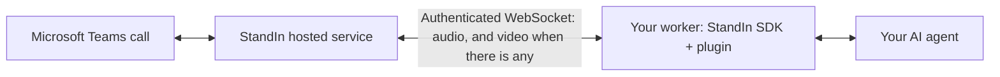

**StandIn is your AI teammate in Microsoft Teams calls.** The hosted service joins the call and owns
the Microsoft side. The SDK runs in your worker, answers the call StandIn dials, and hands the audio
to your agent.

There is one SDK, in two languages, with the same contract in both:

<CardGroup cols={2}>
  <Card title="Python SDK" icon="python" href="/python-sdk/overview">
    `standin-sdk`, imported as `standin`. Plugins for ElevenLabs, Deepgram, Cartesia, LiveKit and Hermes, and an echo to test with.
  </Card>
  <Card title="TypeScript SDK" icon="js" href="/typescript-sdk/overview">
    `@komaa/standin-sdk`. Plugins for ElevenLabs, Deepgram, Cartesia, OpenAI Realtime, LiveKit and OpenClaw, and an echo to test with.
  </Card>
</CardGroup>

Install the one for your language and start from the quickstart:

<CodeGroup>
```bash Python
pip install standin-sdk
```

```bash TypeScript
npm install @komaa/standin-sdk
```
</CodeGroup>

## Start with your framework

| Your agent | Language | Start with |
|---|---|---|
| ElevenLabs | Python or TypeScript | [ElevenLabs Microsoft Teams connector](https://github.com/komaa-com/standin/tree/main/examples/elevenlabs-msteams-connector) |
| Deepgram | Python or TypeScript | [Deepgram Microsoft Teams connector](https://github.com/komaa-com/standin/tree/main/examples/deepgram-msteams-connector) |
| Cartesia | Python or TypeScript | [Cartesia Microsoft Teams connector](https://github.com/komaa-com/standin/tree/main/examples/cartesia-msteams-connector) |
| OpenAI Realtime | TypeScript | [OpenAI Microsoft Teams connector](https://github.com/komaa-com/standin/tree/main/examples/openai-msteams-connector) |
| LiveKit | Python or TypeScript | [LiveKit Microsoft Teams connector](https://github.com/komaa-com/standin/tree/main/examples/livekit-msteams-connector) |
| Hermes Agent | Python | [Hermes Microsoft Teams connector](https://github.com/komaa-com/standin/tree/main/examples/hermes-msteams-connector) |
| OpenClaw | TypeScript | [OpenClaw Microsoft Teams connector](https://github.com/komaa-com/standin/tree/main/examples/openclaw-msteams-connector) |
| Something else, or your own | Python or TypeScript | [Quickstart](/quickstart), then the echo plugin in your language |

ElevenLabs, Deepgram, Cartesia and OpenAI need nothing beyond the SDK itself: they are reached
over an ordinary WebSocket, so installing StandIn is installing them.

Not sure yet? Run the [quickstart](/quickstart). It answers a real Microsoft Teams call with an echo, which
proves your secret, your tunnel and your StandIn identity before any agent is involved.

## How it fits together



Two halves, and you run only one of them.

**StandIn handles the Microsoft Teams connection.** It dials your worker over one authenticated
WebSocket per call.

**Your worker is the brain.** The SDK authenticates that connection and owns the wire protocol,
audio timing, sequence numbers, capacity, draining and shutdown. Your handler or framework plugin
connects the call to the agent and its voice provider.

## The seam

A handler implements only the callbacks it needs. A missing one is a no-op, nothing inherits from
anything, and the session it is handed is how it reaches the call. Here is a whole working plugin.

<CodeGroup>
```python Python
from standin import CallServer, CallSession


class EchoHandler:
    async def on_start(self, session: CallSession) -> None:
        self._call = session

    async def on_caller_audio(self, pcm: bytes) -> None:
        await self._call.send_audio(pcm)


server = CallServer(handler_factory=EchoHandler)
await server.start()
```

```typescript TypeScript
import { CallServer, type CallSession } from "@komaa/standin-sdk";

class EchoHandler {
  #call!: CallSession;
  async onStart(session: CallSession) {
    this.#call = session;
  }
  async onCallerAudio(pcm: Buffer) {
    await this.#call.sendAudio(pcm);
  }
}

const server = new CallServer({ handlerFactory: () => new EchoHandler() });
await server.start();
```
</CodeGroup>

That is a real plugin, not a sketch: it answers a live Microsoft Teams call. A handler that wants
only audio implements only `on_caller_audio` / `onCallerAudio`, and everything else stays out of the
file.

[Architecture](/concepts/architecture) has the full seam, the two lanes and the wire facts.

## What your agent can do on the call

The echo above is the floor, not the ceiling. Every lane below ships in **both languages** and has a
page of its own. The cards go to the Python pages; the
[TypeScript SDK](/typescript-sdk/overview) carries the same set, one for one.

<CardGroup cols={2}>
  <Card title="Speak and be interrupted" icon="waveform-lines" href="/python-sdk/voice">
    Realtime speech-to-speech, or `VoiceLane` running your STT, agent and TTS in order with the
    turn-taking, the pacing and the barge-in already written.
  </Card>
  <Card title="See what the caller is showing" icon="eye" href="/python-sdk/vision">
    The camera and the screen share arrive as frames. The agent looks on demand, looks back at a
    slide already gone while the call is recorded, and shows a chart or a page back on the tile,
    full screen or as a picture-in-picture inset. Six looks a minute by default, so a model cannot
    look in a loop.
  </Card>
  <Card title="Wear a face" icon="face-smile" href="/python-sdk/avatar">
    Send the emotion and the viseme timeline that drives lip-sync. StandIn draws the tile; your
    worker sends the hints and never has to know how.
  </Card>
  <Card title="Behave in a meeting" icon="users" href="/python-sdk/group-calls">
    Silent until a wake phrase names it, then twelve seconds of follow-up so the next question need
    not. Verbal interrupts, and the speaker's name where StandIn sends unmixed audio. A 1:1 call
    answers everything.
  </Card>
  <Card title="Do real work mid-call" icon="screwdriver-wrench" href="/python-sdk/call-tools">
    One set of call tools declared in every provider's own JSON, plus consulting and background work
    for the jobs too slow to hold a call open.
  </Card>
  <Card title="Follow up afterwards" icon="file-lines" href="/python-sdk/minutes">
    Key points, decisions and action items, plus a Word-openable document that appends the
    transcript attributed line by line to whoever said it. And a call back to whoever asked for one,
    once the answer exists.
  </Card>
</CardGroup>

Three more things worth knowing before you pick a shape.

- **Two dialogue modes, both in the SDK.** One realtime speech-to-speech provider doing its own
  turn-taking, or speech to text, then your agent, then speech, with the turn-taking, the pacing and
  the barge-in already written. [Dialogue modes](/concepts/modes).
- **Chat is a lane of its own.** A pasted screenshot, a dragged-in file and a voice note land as one
  turn your agent can answer, voice notes transcribed by the engine you supply, and a reply can
  carry a picture back. [Chat](/python-sdk/chat).
- **The expensive and the sensitive are off until you switch them on.** Outbound calling refuses
  everyone until you list who the agent may ring, then caps it at six an hour. A local file is
  refused until you name a root it may come from. No history of the caller's screen is kept unless
  the call is being recorded. And who may call the agent is a check you write, because the handshake
  proves the call came from StandIn and nothing more. [Security](/python-sdk/security).

[What the SDK gives you](/concepts/features) is the full inventory, and the boundary that goes with
it.

## Two lanes

| Lane | Direction | What you expose |
|---|---|---|
| Calls | StandIn dials your worker | one WebSocket path, port `9442` by default |
| Chat | your worker dials StandIn | nothing at all |

The chat lane is dialed **out** from the worker, so Microsoft Teams chat needs no listener, no open port and
no tunnel, and your agent never holds a Bot Framework credential.

Both lanes authenticate with your connection secret in `STANDIN_SECRET`, and one key covers both.
The exception is a deployment that issued a **separate chat key**: put it in `STANDIN_CHAT_SECRET`
and the chat lane prefers it. Set one key when you were given one, two when you were given two.
[Connection modes](/teams/connection-modes) says which you have.

## Next

<CardGroup cols={3}>
  <Card title="Quickstart" icon="rocket" href="/quickstart">
    Answer a real Microsoft Teams call with an echo, in about ten minutes.
  </Card>
  <Card title="Microsoft Teams setup" icon="microsoft" href="/teams/overview">
    The Microsoft side: bot identity, app package, admin consent.
  </Card>
  <Card title="Expose your agent" icon="globe" href="/expose">
    The one path StandIn dials, and how to prove it is reachable.
  </Card>
</CardGroup>

<Note>
StandIn is independent software. It is not affiliated with, endorsed by, or sponsored by Microsoft.
Microsoft and Microsoft Teams are trademarks of the Microsoft group of companies.
</Note>
