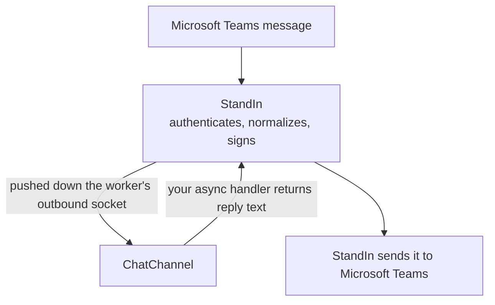

`ChatChannel` is the messages lane. It is the same shape as the call lane, and it is deliberately the easier half: the worker dials **out** and StandIn pushes messages down that socket.

That means no listener, no open port and no tunnel for chat. It also means your agent never holds a Bot Framework credential: StandIn owns the Microsoft Teams bot, authenticates the activity, resolves it to your connection, strips the bot mention, and performs the send on your behalf. Your handler returns text.



Managed connections only, and that needs no flag: the socket authenticates with your connection secret, so if it opens at all you are managed. The [sandbox](/tiers#the-sandbox) has no chat lane. A meeting recap that only posts uses `listen_only=True` so it never answers.

## Meeting recap

`listen_only=True` is how a recap lane posts without answering. The host must supply that outbound chat lane (`ChatChannel.start()`) and a summarization callback (`post_minutes` or the plugin consult). Hang-up does not await the post.

Meeting recaps are best-effort. They may be lost if the worker exits during processing.

## Minimal use

```python
import asyncio

from standin import ChatChannel, InboundMessage


async def on_message(msg: InboundMessage) -> str:
    return f"You said: {msg.text}"


async def main() -> None:
    chat = ChatChannel(respond=on_message)
    await chat.start()
    try:
        await asyncio.Event().wait()
    finally:
        await chat.aclose()


asyncio.run(main())
```

`respond` is an async callable taking an `InboundMessage` and returning the reply text. Returning an empty string makes the channel say so rather than leaving the user watching a typing indicator forever.

## Constructor

```python
ChatChannel(*, respond, secret=None, url=None, chats=None, listen_only=False)
```

| Argument | Default | Meaning |
|---|---|---|
| `respond` | *(required)* | `async (InboundMessage) -> str`. |
| `secret` | `STANDIN_CHAT_SECRET`, else `STANDIN_SECRET` | The key this lane signs with. No secret at all raises `StandInError` naming both variables. |
| `url` | `STANDIN_CHAT_URL`, else `wss://teams.standin.komaa.com/api/chat/channel` | The chat channel to dial. |
| `chats` | `None` | A [`PersonalChats`](#remembering-who-messaged-you) to feed. Every personal message that arrives is remembered in it, which is what later lets a call post back to the caller who sent one. |
| `listen_only` | `False` | Take messages without answering them. `chats` is still fed, `respond` is never called, and nothing is sent back, not even the typing indicator. For a lane that only posts, such as a meeting recap, when something else already answers this connection's chat. |

`await chat.start()` dials StandIn and begins taking messages. `await chat.aclose()` cancels the in-flight turns and closes the socket.

### Which secret

A managed deployment may issue a **separate key for chat**. When it does, set `STANDIN_CHAT_SECRET` and it wins; with one key for both lanes, set only `STANDIN_SECRET` and the chat lane falls back to it. A key scoped to one lane cannot be used on the other, which is the point of issuing two.

<Note>
In Python a blank `STANDIN_CHAT_SECRET` falls through to `STANDIN_SECRET`; the TypeScript twin stops at the first variable that is merely present. Unset the variable rather than blanking it and the two behave alike. See [Configuration](/python-sdk/configuration).
</Note>

## InboundMessage

One user message, already authenticated and resolved to your connection. Reserved bot commands are handled by StandIn and never arrive here. In group and channel scope, only messages that mention the bot are relayed, and the mention is already stripped from `text`.

| Field | Type | Notes |
|---|---|---|
| `tenant_id` | `str` | The Microsoft tenant. Echo it back exactly. |
| `conversation_id` | `str` | The Microsoft Teams conversation. Echo it back exactly. |
| `activity_id` | `str` | The activity this is a reply to, and the idempotency key. |
| `scope` | `str` | `personal`, or a group or channel value. An open enum: an unknown value relays as a group chat rather than being rejected. |
| `text` | `str` | The message, with any bot mention removed. Empty on a card action. |
| `sender_name` | `str \| None` | Display name. |
| `sender_aad_id` | `str \| None` | AAD object id, when Microsoft Teams reported one. |
| `sender_is_guest` | `bool` | |
| `sender_is_linked_owner` | `bool` | The sender is the owner this connection is linked to. |
| `attachments` | `list[dict]` | A pasted screenshot, a dragged-in file or a voice note, as raw dictionaries. `build_chat_turn` turns them into something answerable: see [Attachments in chat](/python-sdk/chat-attachments). |
| `mentions` | `list[str]` | |
| `locale` | `str \| None` | |
| `card_action` | `dict \| None` | The submit payload of an `Action.Submit` on a card this agent sent. `text` is empty on these. |
| `binding_id` | `str \| None` | Which StandIn connection this conversation resolved to. One tenant can hold several connections, so the tenant alone no longer says who a reply is from, and `build_reply` echoes it. |
| `is_personal` | `bool` | Property. True when `scope == "personal"`. |

```python
async def on_message(msg: InboundMessage) -> str:
    if not msg.is_personal:
        # In a group chat you were mentioned by name; keep it short.
        return await agent.brief_answer(msg.text)
    return await agent.answer(msg.text)
```

## parse_inbound

```python
from standin import parse_inbound

message = parse_inbound(body)  # raises ValueError naming the problem
```

Parses and validates one inbound message body. It raises `ValueError` with the specific problem, which a caller maps to HTTP 400: `malformed json`, `body must be an object`, `tenantId is required` and the same for `conversationId` and `activityId`, each of which has to be a non-empty string, or an unsupported `schemaVersion`. Everything else has a safe default, including `scope`, which reads as `personal` when the message does not say.

`ChatChannel` calls this for you and logs and drops anything malformed. Use it directly only when you are receiving the relay yourself, over the POST lane rather than the socket.

<Note>
The exception type differs between the SDKs: this one raises `ValueError`, the TypeScript twin throws `StandInError`. A caller mapping the failure to HTTP 400 catches a different class in each.
</Note>

## build_reply

```python
from standin import build_reply

reply = build_reply(message, "Here is what I found.")
typing = build_reply(message, "", "typing")
failed = build_reply(message, "Something went wrong.", "error")
with_picture = build_reply(message, "Here is the chart.", image=picture)
```

```python
build_reply(message, text, kind="message", image=None)
```

Builds the reply StandIn expects: `schemaVersion`, `tenantId`, `conversationId`, `replyToId`, `kind`, and an `idempotencyKey` of `"{activityId}:{kind}"`. It adds `bindingId` when the inbound carried one. `text` is omitted for `kind="typing"`, and so is `image`: a typing indicator is a state, not a message.

`image` is an `OutboundImage` from `outbound_image`. See [Sending a picture](/python-sdk/sending-pictures).

<Warning>
`tenantId` and `conversationId` echo the inbound message **exactly**. StandIn rejects a mismatch, and that check is the cross-tenant leak guard the whole relay rests on. Never construct a reply with a tenant or conversation you assembled from somewhere else, and never reuse an `InboundMessage` from one conversation to answer another.
</Warning>

`bindingId` echoes for the same reason one level down, between connections inside one tenant.

That is also the reason `build_reply` takes the message rather than two strings. Passing the message through is what makes the echo automatic.

## SCHEMA_VERSION

```python
from standin import SCHEMA_VERSION  # 1
```

A major version. Additive evolution does not bump it, because the schema already requires receivers to ignore unknown fields. An integer above yours therefore means incompatible semantics, and `parse_inbound` refuses the message rather than guessing.

## What the channel does for you

Beyond parsing, `ChatChannel` handles four things that are easy to get wrong.

**Deduplication.** StandIn delivers at least once. A redelivery of the same `tenantId:conversationId:activityId` must not start a second turn, so the channel keeps a bounded LRU of what it has seen. An aged-out redelivery running again is acceptable at-least-once behaviour; a fresh double-run is not.

**Per-conversation ordering.** The schema promises ordering within a conversation, so turns for one conversation are chained rather than run as independent tasks, which would let replies overtake each other. Different conversations still run concurrently. A failed turn does not dam the chain behind it.

**Typing indicators.** A typing reply is sent before your handler runs, and it does not sit in front of the turn. The indicator still lands first.

**Bounded turns.** Because turns within a conversation are serialized, a hung turn would wedge that conversation forever. Each one is bounded at `ChatChannel.TURN_TIMEOUT_S`, which is 300 seconds: generous, because agent turns legitimately run long. A timeout or an exception sends an error reply rather than silence, since after a typing indicator, silence looks exactly like a hang. It is a public class attribute, so you can raise or lower it; the TypeScript twin holds the same bound in a module constant a caller cannot change.

## Remembering who messaged you

A one-to-one **call** carries no thread id that can be posted into. So the only honest source for "where do I send this person something" is a message that person actually sent, and `PersonalChats` is where those are remembered.

```python
from standin import ChatChannel, PersonalChats

chats = PersonalChats()
chat = ChatChannel(respond=on_message, chats=chats)

# later, on a call
target = chats.for_caller(
    caller_aad_id=session.start.caller.aad_id,
    tenant_id=session.start.tenant_id,
)
```

`remember()` is fed by the channel on every inbound message, and `for_caller()` is asked from the call lane. At most 512 senders are kept, keyed by tenant and directory id, oldest evicted, because a tenant with many users must not grow without bound inside a worker that is also carrying live audio. A record stays usable for `CHAT_FALLBACK_WINDOW_MS`, which is 12 hours: somebody who messaged this morning and calls this afternoon is plainly the same person in the same working context, and a record older than that is a guess about who is on the phone.

`PersonalChat` is the record itself: `conversation_id`, `tenant_id`, `aad_id`, `display_name` and `at_ms`.

Three decisions inside it are worth knowing, because each one closes a way of posting call content into the wrong conversation:

**Scope decides what is personal, and only scope.** A conversation-id prefix looks like it would do the same job and does the opposite: a personal chat with a bot is addressed `a:1...` while `19:...` is exactly the group and channel shape this has to exclude. Without the scope test, an @mention in a team channel would make that channel somebody's "personal" chat and put their private escalation in front of their team.

**A message is remembered behind the dedupe.** A redelivery of this morning's message must not make the sender look like they messaged just now, because the recency window is evidence about who is on the phone and a repeat is not.

<Note>
That last one is the one real behavioural difference between the SDKs on this lane: the TypeScript twin remembers a message **before** the dedupe runs, so a redelivery there refreshes the 12 hour window. The dedupe still governs the turn in both, so only the freshness of the record differs.
</Note>

**`for_caller` enforces four rules, all of which must hold.** The conversation was recorded from a personal-scope message; it belongs to the tenant this worker is bound to, never the caller's own, which is absent or foreign for a guest; it was seen inside the window; and the call names its caller, whose directory id is the remembered sender's. A call that identifies nobody gets nothing. `allow_unidentified=True` relaxes the last rule for a single-operator install, and warns by name every time, because with it on every anonymous caller collapses onto whoever chatted last.

<Warning>
Both lanes have to run in **one process**. `PersonalChats` is in-memory: across processes a caller who has not messaged the bot inside the window simply has no personal target.
</Warning>

This is where [Meeting recap](/python-sdk/minutes#where-the-minutes-go) gets the `caller_chat` it resolves a delivery target from.

## Posting without an inbound message

```python
await chat.send(
    tenant_id=session.start.tenant_id,
    conversation_id=session.start.thread_id,
    text="Here are the notes from that call.",
    idempotency_key=f"{session.call_id}:notes",
)
```

```python
chat.send(*, tenant_id, conversation_id, text, image=None, binding_id=None, idempotency_key=None)
```

Useful from inside a call. Best-effort: it returns `False` rather than raising, because a failed post must never break a live call. Pass an `idempotency_key` when a retry would otherwise post twice.

`image` attaches one picture, the same `OutboundImage` `build_reply` takes. `binding_id` names which of a tenant's connections the post is from, and there is no inbound message here to echo it off, so pass it yourself when the tenant has more than one.

## Authentication

The outbound dial signs the channel name with `sign_handshake`, using your connection secret, in the `X-StandIn-Timestamp` and `X-StandIn-Signature` headers. That is the same v1 scheme the inbound call handshake uses, in the opposite direction: here your worker signs and StandIn verifies.

The separate POST relay lane signs the **body** instead, with a longer window. The two are not interchangeable. See [Security](/python-sdk/security).

## Next

<CardGroup cols={2}>
  <Card title="Attachments in chat" icon="paperclip" href="/python-sdk/chat-attachments">
    One call turns a pasted screenshot, a file or a voice note into a turn your agent can answer.
  </Card>
  <Card title="Sending a picture" icon="image" href="/python-sdk/sending-pictures">
    `outbound_image`, the checks it runs, and why a reply carries bytes rather than a link.
  </Card>
  <Card title="Security" icon="shield" href="/python-sdk/security">
    Both signing lanes, and why they differ.
  </Card>
  <Card title="Call handler" icon="code" href="/python-sdk/call-handler">
    The voice half of the same connection.
  </Card>
</CardGroup>
