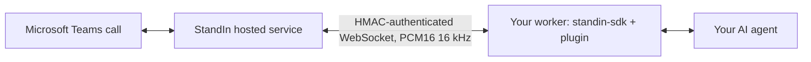

`standin-sdk` is the worker side of a StandIn call. StandIn is the hosted bridge that joins the Microsoft Teams call: it owns the Microsoft side entirely, the bot registration, Graph, media negotiation and the avatar tile, and it talks to your worker over one authenticated WebSocket per call. This package is that socket's other end.

You write a handler. The SDK does everything else on the wire.

```bash
pip install standin-sdk
```

One package, imported as `standin`, and every plugin ships inside it. That line alone is
already enough for [ElevenLabs](/python-sdk/plugins/elevenlabs),
[Deepgram](/python-sdk/plugins/deepgram) and [Cartesia](/python-sdk/plugins/cartesia): they are
reached over an ordinary WebSocket, so they need nothing beyond aiohttp.

A capability lands once in the core and reaches every plugin, which is why there is no
second package to keep in step.

## The four extras

An extra is either a framework that runs inside your process or a capability that needs a wheel most
deployments do not want. Both kinds are off by default, and the two capability extras are designed to
stay off rather than to fail.

| Extra | Install | What it adds | Without it |
|---|---|---|---|
| `livekit` | `pip install "standin-sdk[livekit]"` | `livekit-agents`, for the in-process LiveKit plugin. | Importing the plugin raises `PluginNotInstalled` naming the extra. |
| `hermes-agent` | `pip install "standin-sdk[hermes-agent]"` | Nothing, deliberately. Hermes ships its own host and loads the adapter through an entry point, so there is nothing left for pip to fetch. The extra stays declared so the documented install line resolves. | The adapter is already in the base package. |
| `tile` | `pip install "standin-sdk[tile]"` | Pillow, to encode frames of your own video for the bot's tile. | The tile relay logs one line and stays off. The caller hears the agent and sees StandIn's own avatar, which is what they would have seen anyway. |
| `render` | `pip install "standin-sdk[render]"` | `pypdfium2` and Pillow, to rasterise a PDF page onto the tile. Office documents additionally want LibreOffice on `PATH`, which is not a wheel. | Showing a file answers with a sentence naming the missing renderer, which the model reads out instead of promising something it cannot do. |

`pip install "standin-sdk[all]"` takes all three wheels at once.

Plugins are resolved on first touch and never at `import standin`, so the base install is aiohttp and
nothing else. `standin.plugins.livekit` is the stable spelling, because the path says which layer a
name comes from; `standin.livekit` works as a shorthand and is not the documented one.

## How it fits together



One call is one socket. StandIn dials `wss://<your-host>/msteams/calling/{callId}`, your `CallServer` answers it, verifies the handshake, and builds one handler for that call. When the call ends, the handler is closed and the slot is freed.

## What the SDK owns, and what you own

Everything that is the same whichever agent framework you use belongs to `CallServer`. That split is why a StandIn plugin is small.

| The SDK owns | Your code owns |
|---|---|
| The socket StandIn dials, and the HMAC handshake with its single-use replay guard | What the caller's voice means |
| Capacity, draining, and the one-live-session-per-`callId` rule | Where the reply audio comes from |
| The wire protocol: `session.start`, `audio.frame`, `video.frame`, `ping`, `participants`, `dtmf`, `recording.status`, `assistant.say`, `session.end` inbound, and `audio.frame`, `assistant.cancel`, `expression`, `speech.marks`, `display.image`, `display.frame`, `pong`, `session.end` outbound | When to interrupt a turn |
| Outbound sequence numbers and the audio timeline | Your model, your prompt, your tools |
| Five timers: the pre-start watchdog, the caller-audio idle watchdog, the `on_start` timeout, the stale-call reaper and the optional call-duration ceiling | Your own cleanup in `aclose` |
| Idempotent, shielded teardown that always frees the slot | |

A handler never tracks a sequence number, never builds a frame, and never sees a signature.

## The three things you import

<CardGroup cols={3}>
  <Card title="CallServer" icon="server" href="/python-sdk/call-server">
    Answers the dial, authenticates it, speaks the wire protocol, drives one handler per call.
  </Card>
  <Card title="CallHandler" icon="plug" href="/python-sdk/call-handler">
    The five-method seam your plugin implements. Every method is optional.
  </Card>
  <Card title="ChatChannel" icon="comments" href="/python-sdk/chat">
    The Microsoft Teams messages lane. Dialed out from your worker, so chat needs no listener and no bot credential.
  </Card>
</CardGroup>

## The whole contract

```python
from standin import CallServer, CallSession


class EchoHandler:
    async def on_start(self, session: CallSession) -> None:
        self._call = session

    async def on_caller_audio(self, pcm: bytes) -> None:
        await self._call.send_audio(pcm)  # PCM16, 16 kHz, mono


server = CallServer(handler_factory=EchoHandler)
await server.start()
```

`CallHandler` is a `typing.Protocol`, not a base class. Nothing inherits from anything, a missing method is a no-op, and a synchronous method is accepted where there is nothing to await.

## The whole surface, by lane

Those three names are the seam. Everything else in the package is a lane you can ignore until you
need it. Every name below resolves from `import standin` unless the row says otherwise, and the page
in the last column is the lane's page rather than a per-name reference: it is where the reasoning
lives, and this table is how you find which page that is.

| Lane | What is on the barrel | Page |
|---|---|---|
| The call seam | `CallServer`, `CallHandler`, `CallSession`, `HandlerFactory`, `SpeakerHandler`, `VideoHandler`, `StandInError`, `PluginNotInstalled`, `__version__` | [CallServer](/python-sdk/call-server), [Call handler](/python-sdk/call-handler) |
| Audio | `FrameAligner`, `resample_pcm16`, `frame_duration_ms`, `pcm16_rms`, `FRAME_BYTES`, `FRAME_MS`, `SAMPLE_RATE_HZ`, `REALTIME_SAMPLE_RATE_HZ`, `BYTES_PER_SAMPLE`, `NUM_CHANNELS` | [Audio](/python-sdk/audio) |
| Turn-taking | `VoiceLane`, `VoiceTurn`, `UtteranceSegmenter`, `PacedPlayback`, `Playback`, `decode_wav`, `encode_wav`, the `TROUBLE_` sentences | [Turn-taking](/python-sdk/voice) |
| Realtime providers | `StartupBuffer`, `EchoGuard`, `ECHO_SUPPRESSION_WINDOW_MS`, `ECHO_BARGE_IN_RMS`, `MAX_PENDING_AUDIO`, `MAX_PENDING_CONTEXT` | [Realtime providers](/python-sdk/realtime-providers) |
| Group calls | `GroupGate`, `GateDecision`, `is_addressed`, `is_meeting_thread`, `is_verbal_interrupt`, `DEFAULT_FOLLOW_UP_WINDOW_MS` | [Group calls](/python-sdk/group-calls) |
| Vision | `VideoFrame`, `parse_video_frame`, `FrameDescriber`, `display_image`, `display_frame`, `VisionTools`, `KeyframeStore`, `VisionBudget`, `PageRenderer`, `AmbientVision` | [Vision and the avatar](/python-sdk/vision) |
| The avatar | `expression`, `infer_emotion`, `speech_marks`, `SpeechMark`, `ExpressionCue`, `EMOTIONS`, `TurnLipSync`, `estimate_visemes`, `visemes_from_alignment`, `TileStream`, `jpeg_encoder` | [The avatar](/python-sdk/avatar) |
| Call tools | `CallTools`, `ToolSpec`, `tool_schemas`, `BUILT_IN_TOOLS`, `SHOW_PAGE_TOOL` | [Call tools](/python-sdk/call-tools) |
| Consulting | `Consultant`, `BackgroundTasks`, `BackgroundTask`, `CONSULT_TOOL`, `BACKGROUND_TASK_TOOL` | [Consulting](/python-sdk/consulting) |
| Meeting recap | `Transcript`, `post_minutes`, `resolve_minutes_target`, `minutes_prompt`, `write_minutes_docx`, `RecapResult`, `DeliveryTarget`, `MINUTES_TOOL` | [Meeting recap](/python-sdk/minutes) |
| Chat | `ChatChannel`, `InboundMessage`, `parse_inbound`, `build_reply`, `PersonalChats`, `PersonalChat` | [Chat](/python-sdk/chat) |
| Attachments | `build_chat_turn`, `ChatTurn`, `ChatImage`, `ChatAudio`, `Transcriber`, `fetch_chat_images`, `fetch_chat_audio`, `transcribe_voice_messages`, `spool_clip` | [Attachments in chat](/python-sdk/chat-attachments) |
| Sending a picture | `outbound_image`, `OutboundImage`, `sniff_image_type`, `sanitize_image_name`, `parse_media`, `load_media`, `media_roots`, `AgentMedia` | [Sending a picture](/python-sdk/sending-pictures) |
| Reaching people | `OutboundCaller`, `OutboundPolicy`, `OutboundLane`, `PendingMessages`, `VoiceDelivery`, `LiveCalls` | [Reaching people](/python-sdk/reaching-people) |
| Security | `sign_handshake`, `verify_handshake`, `sign_body`, `verify_body`, `sign_request`, `canonical_request` | [Security](/python-sdk/security) |
| Configuration | Not on the barrel: `from standin.config import required, optional, flag, json_object, vendor_host` | [Configuration](/python-sdk/configuration) |
| Checking the install | `run_smoke`, `smoke_report`, `SyntheticCall` | [Checking the install](/python-sdk/checking-the-install) |

## The two SDKs are one API

The wire protocol, the audio format and the HMAC are byte-identical between the languages, and shared
conformance vectors prove it rather than promising it: both protocol modules are generated from one
schema and gated against drift.

The core seam is the same in both. Same handler methods, same session, same watchdogs, same defaults.
A handler ported between the languages changes only its method names: Python is snake_case,
TypeScript is camelCase. Around the seam a few peripheral helpers exist in one language only, and the
page each one belongs to says so. Three that matter here:

- **Timers are seconds in Python and milliseconds in TypeScript.** `pre_start_timeout=10.0` against
  `preStartTimeoutMs: 10000`. The names differ too, so a straight port does not compile, but a
  configuration file copied between two workers does not complain.
- **The two optional video callbacks sit differently.** `on_video_frame` and `on_speaker_change` live
  on separate `VideoHandler` and `SpeakerHandler` protocols here, because `CallHandler` is
  `runtime_checkable` and a sixth member would break `isinstance` for every handler written before the
  vision lane existed. In TypeScript every handler member is optional, so they are simply two more of
  them.
- **Who may call the agent is a TypeScript module.** `isInboundCallAllowed` and its companions ship in
  that SDK only. A Python worker writes the same check in its own handler, which is the
  [refusing a call](/python-sdk/call-handler#refusing-a-call) snippet.

## Why the plugin lists differ per language

Most plugins exist in both languages, and the ones that do not are settled by the same rule: **which
language a plugin lives in is decided by the framework it integrates, not by preference.**

ElevenLabs, Deepgram, Cartesia and LiveKit are in both trees.
[Hermes Agent](/python-sdk/plugins/hermes-agent) has to be Python, because Hermes loads the adapter
into its own process. [OpenClaw](/typescript-sdk/plugins/openclaw) is TypeScript for the same reason
in reverse, and [OpenAI Realtime](/typescript-sdk/plugins/openai) is a TypeScript plugin today.

Nothing is missing from either side of the wire: both SDKs speak the same protocol, run the same
conformance vectors, and answer the same calls.

## Where the SDK stops

Three boundaries, and each is a real line rather than a disclaimer.

**Speech and reasoning are your framework's.** Speech recognition, speech generation and the model
that decides what to say belong to your provider. The SDK carries PCM in both directions and gives you
the turn-taking pieces if you are assembling three vendors yourself, but nothing in this package
transcribes, synthesizes or thinks.

**The Microsoft side is StandIn's.** Bot registration, Graph, the media negotiation and the call
itself. Your worker never holds a Bot Framework credential and never talks to Microsoft.

**StandIn draws the avatar tile; the SDK sends it hints.** This is the boundary most often described
wrongly, so it is worth stating exactly. The SDK does carry the vision and avatar lane:
`session.express` names an emotion, `session.send_speech_marks` sends the viseme timeline that drives
lip-sync, `session.display_image` puts a picture on the tile, `session.send_tile_frame` puts one frame
of your own video on it, and `session.latest_video_frame` and `CallHandler.on_video_frame` are how the
caller's camera and screen share reach you. Whole modules back those: `avatar`, `lipsync`, `vision`,
`vision_tools`, `tile` and `ambient`, all on the barrel above. What the SDK does not do is render
anything. It never composites a face, never encodes the avatar and never knows how the tile is drawn.
See [Vision and the avatar](/python-sdk/vision) and [The avatar](/python-sdk/avatar).

A message type this SDK does not recognise is ignored by contract, which is what lets an older worker
and a newer StandIn interoperate. That rule is about unknown frames, not about the avatar: those are
frames the SDK itself sends.

## Audio format

PCM16, 16 kHz, mono, little-endian, in both directions. `on_caller_audio` receives it and `send_audio` expects it back. Realtime models usually speak 24 kHz, which is why the SDK ships a resampler and a frame aligner. See [Audio](/python-sdk/audio).

## Requirements

- Python 3.10 or newer
- `aiohttp` 3.9 or newer, the only runtime dependency
- A StandIn identity and its connection secret, from [standin.komaa.com](https://standin.komaa.com)
- A public `wss://` route to your worker, so StandIn can dial in

## Next

<CardGroup cols={2}>
  <Card title="Quickstart" icon="rocket" href="/python-sdk/quickstart">
    Install the package, run the echo plugin, and hear yourself on a real Microsoft Teams call.
  </Card>
  <Card title="Call handler" icon="code" href="/python-sdk/call-handler">
    The five methods, one at a time, with a full worked handler.
  </Card>
  <Card title="Audio helpers" icon="waveform" href="/python-sdk/audio">
    `resample_pcm16`, `FrameAligner`, and the 16 kHz against 24 kHz problem.
  </Card>
  <Card title="Security" icon="shield" href="/python-sdk/security">
    The HMAC handshake, the two signing lanes, and what the SDK refuses.
  </Card>
</CardGroup>
