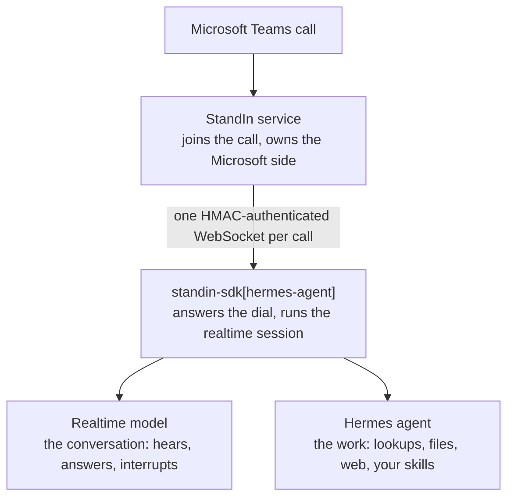

`standin-sdk[hermes-agent]` answers Microsoft Teams calls with your [Hermes Agent](https://github.com/NousResearch/hermes-agent) agent.

StandIn answers the Microsoft Teams call and dials your worker. This plugin answers that dial, connects a realtime speech-to-speech model for the conversation, and gives that model one door into Hermes, so the caller talks to the same assistant they know from chat, with their own tools, files and skills behind it.

<Note>
**Realtime speech-to-speech.** The plugin drives a realtime model for the conversation, which is
what keeps a call at conversational latency, so a realtime provider key is required alongside the
StandIn secret. [Scope](#scope) has the whole boundary in one list.
</Note>

## Who is the brain

The realtime model is. It hears the caller and answers them, at conversational latency. Hermes is reached only when the model calls `hermes_agent_consult`, and it never sees audio.



The model is good at conversation, Hermes is good at work. That split is the whole design.

## Install

Into the Python environment that runs Hermes:

```bash
pip install "standin-sdk[hermes-agent]"
```

Hermes loads the plugin **in-process**, through the `hermes_agent.plugins` entry point. There is no HTTP hop to Hermes, no session header, and no second service to run.

```toml
[project.entry-points."hermes_agent.plugins"]
msteams_bridge = "standin.plugins.hermes_agent"
```

The entry point key is `msteams_bridge`, the name shown in `hermes plugins list` and used in `plugins.enabled`.

The Hermes host is deliberately **not** a dependency of the package. Hermes is not on PyPI: it is the application the plugin is installed into. Everything that does not need the host works without it, and everything that does raises `HermesUnavailable` with a sentence saying so.

## Setup

```yaml
# <hermes home>/config.yaml
plugins:
  enabled: [msteams_bridge]
  entries:
    msteams_bridge:
      config:
        # Deny by default. Put the AAD object ids that may call.
        allowlist: ["00000000-0000-0000-0000-000000000000"]
        session_scope: per-aad
        realtime:
          voice: alloy
```

```bash
export STANDIN_SECRET=...      # from the StandIn portal
export OPENAI_API_KEY=...      # the realtime model
hermes msteams-bridge serve
```

Then expose port `9442` at the `/msteams/calling` path and register the public `wss://` URL as your StandIn identity's agent voice URL. [Expose your agent](/expose) carries the mount command and the probes, and it is the only page that does: three spellings of one URL across three pages is what caused a live incident here.

Call your StandIn number.

### Check before you call

```bash
hermes msteams-bridge status
```

Answers "would a call work right now?" without placing one: it checks the secret, the realtime key and every Hermes surface the call needs, and names what is missing.

```bash
hermes msteams-bridge smoke
```

Answers the same question by placing one. It rings this worker's own handler on loopback and exits non-zero if audio did not make the round trip, so CI fails on a bad install. See [Checking the install](/python-sdk/checking-the-install).

There are exactly three subcommands, `status`, `smoke` and `serve`, and the set is deliberate.

### Running without Hermes

```bash
STANDIN_SECRET=... OPENAI_API_KEY=... python -m standin.plugins.hermes_agent
```

The same listener with no host. The call is answered and the model talks; `hermes_agent_consult` replies, in words, that it cannot reach its tools. Useful for checking a secret, a tunnel and a StandIn identity before standing up Hermes.

## Configuration

The `plugins.entries.msteams_bridge.config` block, with a `MSTEAMS_BRIDGE_*` environment variable as the fallback for each key. Both are supported because both already exist in the field.

Copy each allowlisted id from `session.start.caller.aad_id` on an inbound call. Emails never match.

| Key | Environment | Default | Meaning |
|---|---|---|---|
| `allowlist` | `MSTEAMS_BRIDGE_ALLOWLIST` | *(empty)* | AAD object ids that may call. **Empty denies everyone** unless `allow_all`. |
| `allow_all` | `MSTEAMS_BRIDGE_ALLOW_ALL` | `false` | Accept any caller. Explicit opt-in. |
| `allowlist_allow_names` | `MSTEAMS_BRIDGE_ALLOWLIST_ALLOW_NAMES` | `false` | Match display names too. Spoofable, so off by default. |
| `require_recording` | `MSTEAMS_BRIDGE_REQUIRE_RECORDING` | `true` | Wait for the Microsoft Teams recording banner before speaking or listening. |
| `meeting_recap` | `MSTEAMS_BRIDGE_MEETING_RECAP` | `false` | After the call ends, post minutes to the Microsoft Teams chat. Needs the StandIn chat lane and a summarization consult. Best-effort: hang-up does not await the post. Transcript is written to disk first. |
| `session_scope` | `MSTEAMS_BRIDGE_SESSION_SCOPE` | `per-call` | Memory of the agent session used for consults and the minutes: `per-call`, `per-thread`, `per-aad`. |
| `wake_phrases` | `MSTEAMS_BRIDGE_WAKE_PHRASES` | `assistant, hermes` | What addresses the assistant in a meeting. |
| `require_address` | `MSTEAMS_BRIDGE_REQUIRE_ADDRESS` | `true` | Stay silent in a meeting until addressed. |
| `follow_up_window_ms` | `MSTEAMS_BRIDGE_FOLLOW_UP_WINDOW_MS` | `12000` | How long an addressed turn keeps the floor. |
| `consult_timeout_s` | `MSTEAMS_BRIDGE_CONSULT_TIMEOUT_S` | `45` | How long one agent consult may take. |
| `consult_model` | `MSTEAMS_BRIDGE_CONSULT_MODEL` | *(the host's `model:`)* | Override the consult's model. |

The `realtime:` sub-block configures the provider:

| Key | Environment | Default |
|---|---|---|
| `backend` | `MSTEAMS_BRIDGE_REALTIME_BACKEND` | OpenAI; set `azure` for Azure OpenAI |
| `api_key` | `MSTEAMS_BRIDGE_REALTIME_API_KEY` | `OPENAI_API_KEY`, or `AZURE_OPENAI_API_KEY` / `AZURE_FOUNDRY_API_KEY` |
| `model` | `MSTEAMS_BRIDGE_REALTIME_MODEL` | `gpt-realtime` |
| `voice` | `MSTEAMS_BRIDGE_REALTIME_VOICE` | `alloy` |
| `azure_endpoint` / `azure_deployment` | `MSTEAMS_BRIDGE_AZURE_ENDPOINT` / `_DEPLOYMENT` | none |
| `azure_api_version` | `MSTEAMS_BRIDGE_AZURE_API_VERSION` | `2024-10-01-preview`, on the Azure path only |
| `url` | `MSTEAMS_BRIDGE_REALTIME_URL` | derived from the backend; set it to dial a socket of your own |
| `instructions` | `MSTEAMS_BRIDGE_REALTIME_INSTRUCTIONS` | a short voice-behaviour prompt that says nothing about identity |
| `languages` | `MSTEAMS_BRIDGE_LANGUAGES` | detect and mirror the caller |
| `input_transcribe_model` | `MSTEAMS_BRIDGE_INPUT_TRANSCRIBE_MODEL` | `whisper-1`; `off`, `none` or `disabled` turns it off |

<Warning>
**Three things select Azure, not one.** `backend: azure` is the explicit form, but setting
`azure_endpoint` alone, or giving a `url` with `azure.com` anywhere in it, also switches the whole
provider over: the key falls back to `AZURE_OPENAI_API_KEY` and then `AZURE_FOUNDRY_API_KEY`, the
header becomes `api-key` instead of a bearer token, and `azure_deployment` becomes the model name.
Leaving a stale `azure_endpoint` in a config block is therefore enough to send an `OPENAI_API_KEY`
deployment down the Azure path, where that variable is never read. `hermes msteams-bridge status`
does catch it, but it reports no realtime API key, which reads as a missing key rather than as the
wrong backend.
</Warning>

Three more keys tune **turn detection**, which is what to reach for when the assistant interrupts too eagerly or waits too long before answering:

| Key | Environment | Default |
|---|---|---|
| `vad_threshold` | `MSTEAMS_BRIDGE_VAD_THRESHOLD` | `0.5` |
| `prefix_padding_ms` | `MSTEAMS_BRIDGE_PREFIX_PADDING_MS` | `300` |
| `silence_duration_ms` | `MSTEAMS_BRIDGE_SILENCE_DURATION_MS` | `500` |

The default `instructions` are deliberately about voice behaviour and not about who the assistant is: identity comes from the operator's own Hermes configuration through the consult boundary, so the caller talks to the same assistant they know from chat. Override it and you are replacing the voice manner, not the personality.

The listener itself belongs to the SDK: `STANDIN_SECRET`, `STANDIN_PORT` (9442), `STANDIN_HOST` (0.0.0.0), `STANDIN_WS_PATH` (`/msteams/calling`). Unfinished recaps sit under `STANDIN_RECAP_DIR`, else `STANDIN_STATE_DIR/recap`, else `~/.standin/state/recap`.

<Warning>
Turning `input_transcribe_model` off disables the group gate and the verbal interrupts as well, because both read the caller's transcript. The plugin logs a warning when it starts a call that way.
</Warning>

## What the model can call

| Tool | Does |
|---|---|
| `hermes_agent_consult` | Runs the caller's real Hermes agent: lookups, files, web, tools, installed skills. Returns a short spoken result. |
| `set_call_language` | Pins the call to one language, applied to the session in flight. |

Neither ever raises at the model. A consult that times out, and a tool name the model invented, both
come back as a sentence it can recover from, because a tool result is fed straight into a live
conversation and an exception there leaves the caller listening to nothing.

## What Hermes itself gains

Enabling the plugin also registers one Hermes tool, `msteams_bridge_status`, in a `msteams_bridge`
toolset. It takes no arguments and answers the same question as `hermes msteams-bridge status`, so
you can ask your assistant in chat whether a call would work right now. It is registered when the
plugin is enabled, not when the listener runs, so the answer is available in a Hermes process that
is not serving calls at all.

## In a meeting

The assistant stays silent until somebody says one of the wake phrases, then keeps answering for `follow_up_window_ms` without needing the name again. The machinery is the SDK's own `GroupGate`, which [Group calls](/python-sdk/group-calls) documents for a handler you write yourself; the keys above are this plugin's way of configuring it.

Saying "stop" or "wait" as a whole utterance cuts playback in code, whether or not the model would have stopped. Phrases ship for four languages, English, Arabic, French and German, and the match is on the whole utterance rather than a substring, so "stop by the store" is a sentence rather than an interruption. [Stop means stop](/python-sdk/group-calls#stop-means-stop) has the set and the normalisation.

The gate decides "is this a meeting?" from the **thread id**: Microsoft Teams gives a meeting or channel conversation a thread beginning `19:`, and it is present in `session.start` on every call. The participant count is kept as a second, corroborating signal that can only add certainty, never remove it. A participant count does not arrive on the meeting-join path, so a gate that used only that number would answer every turn of every meeting it was invited to.

The goodbye was the other fix. StandIn sends a closing line when it is about to end a call, so it almost always arrives while the model is mid-answer. The old path injected it with a plain say, whose response creation is guarded on "is a response already active", so the guard swallowed it and the caller heard nothing before the line went dead. This plugin cancels the response first, then speaks.

## Scope

**The conversation is realtime speech-to-speech.** The provider is OpenAI or Azure OpenAI out of the
box, and `realtime.url` points the same protocol at a socket of your own. A provider that offers only
speech to text and text to speech is not one this plugin can drive: the whole design rests on the
model hearing the caller directly, which is where the latency goes.

**The model's tool surface here is the two above.** `hermes_agent_consult` reaches the caller's whole
Hermes agent, so anything Hermes can do in chat it can do on the call through that one door.

That is a boundary of this plugin, not of the call. The StandIn call wire carries vision, expression,
visemes and display messages as well as audio, and this plugin already drives the expression and
viseme half itself: see [On the tile](#on-the-tile). What it does not do is put the SDK's
model-facing tools into the Hermes realtime session. Reach for `VisionTools` and `CallTools`
yourself if your agent needs them:

- looking at a screen share, and showing a picture, a page or a file: [Vision and the avatar](/python-sdk/vision)
- ringing somebody back: [Reaching people](/python-sdk/reaching-people), where `CALL_BACK_TOOL` and `CHAT_CALLBACK_TOOL` ship from the `standin` barrel
- writing up the meeting yourself, if you did not turn `meeting_recap` on: [Meeting recap](/python-sdk/minutes)

## Meeting recap

Off until `meeting_recap: true` (or `MSTEAMS_BRIDGE_MEETING_RECAP=true`). The plugin then:

1. Collects the call transcript.
2. Writes a restart-recoverable local spool before hang-up returns. A process restart drains what was left if that directory survives the process. Treat recap as best-effort unless that directory is on storage that survives a process or container restart. The file stays until posted, expired (24 hours), or the retry limit (8).
3. Posts minutes through chat. If Hermes already gave this process a `respond` handler, recap reuses that lane. If not, it opens a **listen-only** [chat lane](/python-sdk/chat) that never answers.

The host must provide an outbound chat lane and a summarization consult. Hang-up does not wait for the consult. Meeting recaps are best-effort. They may be lost if the worker exits during processing.

<Note>
This is the difference from the OpenClaw plugin. OpenClaw always opens a dedicated listen-only lane when recap is on. Hermes does not open a second lane when the host already answers chat.
</Note>

<Warning>
Delivery uses StandIn's outbound chat socket. That socket exists on the **StandIn Managed Bot**
([Tiers](/tiers)). The sandbox has no chat lane. A bring-your-own-bot identity answers chat through
its Azure Bot messaging URL, not this socket, so this switch will not post there. Put
`STANDIN_RECAP_DIR` on persistent storage when recap reliability matters. A directory that dies with
the process loses unfinished minutes.
</Warning>

`session_scope` keys the **consult that writes the minutes**, not the voice session. Voice is always
one session per call.

## On the tile

The caller sees StandIn's avatar, and this plugin drives its face and its mouth without you doing
anything. Two hints go out per turn:

- **Expression.** An `ExpressionCue` reads the reply text as it is being produced and sends
  `express` when the emotion changes. It is re-read on every piece rather than once at the end,
  because waiting for the final transcript leaves the face wrong for the whole time the reply is
  being spoken. A tool call raises the thinking cue and lowers it in a `finally`, so a model that
  stays silent after a tool result does not leave the face mid-think for the rest of the call.
- **Visemes.** A `TurnLipSync` measures the audio the turn actually sent and hands StandIn one
  mouth timeline per turn, through `send_speech_marks`, when the turn ends.

Both are cosmetic, so every failure in that path is swallowed: the worst acceptable outcome is a
still mouth over correct audio, and the unacceptable one is a dropped turn because a lip shape
raised. [The avatar](/python-sdk/avatar) is the page for doing the same thing from a
handler of your own.

## Full example

[`examples/hermes-msteams-connector`](https://github.com/komaa-com/standin/tree/main/examples/hermes-msteams-connector) has the `.env` layout and a `config.yaml.example` block to merge into your existing Hermes configuration. There is no agent file in it, and that is the point: Hermes already is the agent.

## Next

<CardGroup cols={2}>
  <Card title="Call handler" icon="code" href="/python-sdk/call-handler">
    The seam this plugin implements.
  </Card>
  <Card title="Audio" icon="waveform" href="/python-sdk/audio">
    The 16 kHz wire against a 24 kHz realtime model.
  </Card>
  <Card title="Realtime providers" icon="bolt" href="/python-sdk/realtime-providers">
    The startup buffer, the echo guard and barge-in this plugin sits on.
  </Card>
  <Card title="The avatar" icon="face-smile" href="/python-sdk/avatar">
    The expression and viseme hints this plugin sends for you.
  </Card>
</CardGroup>
