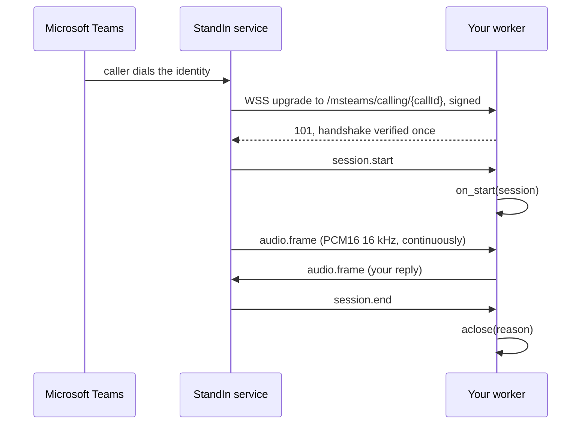

The echo plugin sends your voice back. Run it first, before you involve an agent: if the echo answers, your secret, your tunnel and your StandIn identity are all correct, and anything that breaks afterwards is your agent.

## Prerequisites

- Python 3.10 or newer
- A StandIn identity and its connection secret, from [standin.komaa.com](https://standin.komaa.com)
- A way to expose one local port over HTTPS and WebSocket: a tunnel such as Tailscale Funnel or ngrok, or an ingress in front of a container

## Step 1: install

```bash
python3 -m venv .venv
source .venv/bin/activate
pip install standin-sdk
```

That is the whole install. The echo plugin used below is part of the package, so there is
nothing else to add until you pick a framework.

## Step 2: set the secret

`STANDIN_SECRET` is the only required variable. It is what the handshake signature is checked against, and it is what arms the listener at all: without it, `CallServer` refuses to construct.

```bash
export STANDIN_SECRET="your-StandIn-connection-secret"
export STANDIN_HOST="127.0.0.1"
```

`STANDIN_HOST=127.0.0.1` keeps the listener off every other interface while a local tunnel is the only thing reaching it. The default is `0.0.0.0`, which is what you want in a container behind an ingress. The upgrade is HMAC-authenticated either way.

| Variable | Default | Meaning |
|---|---|---|
| `STANDIN_SECRET` | *(required)* | Connection secret from the StandIn portal. Arms the listener. |
| `STANDIN_PORT` | `9442` | Port the call listener binds. |
| `STANDIN_HOST` | `0.0.0.0` | Bind address. |
| `STANDIN_WS_PATH` | `/msteams/calling` | Path StandIn dials. |
| `STANDIN_CHAT_SECRET` | `STANDIN_SECRET` | The key the chat lane signs with. A managed deployment may issue a separate key for chat, and this one wins when it is set. See [Chat](/python-sdk/chat#which-secret). |
| `STANDIN_CHAT_URL` | `wss://teams.standin.komaa.com/api/chat/channel` | Chat channel the worker dials out to. Only used by [ChatChannel](/python-sdk/chat). |

Those six are all the call and chat lanes read. The other lanes have their own, and
[Configuration](/python-sdk/configuration) is the one page that lists every `STANDIN_` variable with
what owns it.

Configuration is environment-only by design, so credentials never reach a source file and the plugins all read their keys the same way.

## Step 3: run the echo plugin

```bash
python -m standin.plugins.echo
```

You should see one line naming the address, the port and the path it is answering on. The process now waits for a call and does nothing else.

## Step 4: expose the port

StandIn dials your worker, so the worker needs a public `wss://` address with the `/msteams/calling` path routed to port `9442`.

[Expose your agent](/expose#mount-the-call-path) has the mount command for Tailscale Funnel, ngrok,
cloudflared and devtunnel, and the probes that tell a registered mount from a working one. It is the
only page that carries those commands, because three divergent spellings of one URL across three pages
is what caused a live incident here.

Terminate TLS at your public ingress. The path has to match, because that is where the per-call `callId` segment is appended: StandIn dials `wss://<your-host>/msteams/calling/{callId}`.

<Warning>
Expose only that path, and keep the secret out of version control. Anyone who can reach the port still needs a valid signature within the freshness window, but there is no reason to publish more surface than one route.
</Warning>

## Step 5: register the URL and call

In the StandIn portal, set your identity's agent voice URL to the public `wss://` URL, including the `/msteams/calling` path. Then call the identity from Microsoft Teams and talk.

You should hear yourself, delayed by the round trip. The worker logs the call id and the caller's display name when the call starts, and the close reason when it ends.

## What just happened



## If it does not answer

| Symptom | Usual cause |
|---|---|
| `401 unauthorized` in your ingress logs | The secret does not byte-match the portal value, or the clock is more than 60 seconds out. |
| `401 handshake already used` | A correctly signed upgrade was replayed. The single-use guard is doing its job. |
| `409 call already has a live session` | A previous call for that `callId` has not finished tearing down, or a retry arrived while the first socket was still open. |
| `503 at capacity` or `503 draining` | `max_connections` is reached, or the worker is winding down. |
| The call connects and goes silent | The socket authenticated but `session.start` never arrived, and the pre-start watchdog dropped it after ten seconds. Check that the path StandIn dials matches `STANDIN_WS_PATH`. |
| The call connects, stays up, and ends at two minutes with `no-agent-answered` | Nothing ever answered it. The [stale-call reaper](/python-sdk/call-server#the-stale-call-reaper) is doing its job: an agent was never dispatched, or a plugin that joins a room never called `session.mark_answered()`. |

`GET /healthz` on the same port returns `{"ok": true, "calls": <n>}`, which is the cheapest way to confirm the listener is really bound.

## Next

<CardGroup cols={2}>
  <Card title="Write a handler" icon="code" href="/python-sdk/call-handler">
    Replace the echo with your own agent loop.
  </Card>
  <Card title="Copy the echo plugin" icon="copy" href="/python-sdk/plugins/echo">
    The template, and how to turn it into your own plugin.
  </Card>
  <Card title="LiveKit" icon="tower-broadcast" href="/python-sdk/plugins/livekit">
    Two StandIn-specific lines in an ordinary LiveKit agent file.
  </Card>
  <Card title="Hermes Agent" icon="robot" href="/python-sdk/plugins/hermes-agent">
    Your Hermes agent, answering the phone in-process.
  </Card>
</CardGroup>
