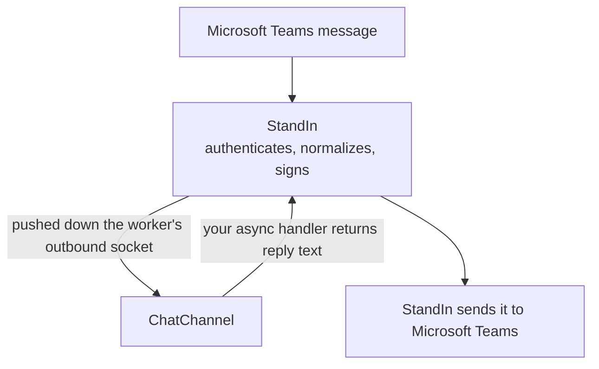

The messages lane puts your agent in Microsoft Teams chat. StandIn owns the Microsoft Teams bot, authenticates
the activity, resolves it to your connection and strips the bot @mention. Your handler returns text and
StandIn performs the Microsoft Teams send.

Two consequences follow, and they are the reason this lane exists in the shape it does:

- **Your agent never holds a Bot Framework credential.** There is nothing to register, rotate or leak.
- **The worker dials out.** The socket is opened from your side, exactly like the call lane, so there
  is no listener, no port to expose and no tunnel.



<Note>
This is the twin of the Python SDK's `standin.chat`, method for method, with this language's
casing. The shared conformance vectors assert both parse and build identical wire payloads. One
behaviour genuinely differs, on shutdown, and it is called out below.
</Note>

## The whole thing

```ts
import { ChatChannel } from "@komaa/standin-sdk";

const chat = new ChatChannel({
  respond: async (message) => `You said: ${message.text}`,
});

await chat.start();
```

`ChatChannel` throws a `StandInError` at construction when no secret is available. Managed
connections only, and that needs no flag: the socket authenticates with your connection secret, so if
it opens at all you are managed.

## Options

| Option | Default | Meaning |
|---|---|---|
| `respond` | required | Async callable taking an `InboundMessage` and returning the reply text. An empty string makes the channel say so rather than leaving the user watching a typing indicator forever. |
| `secret` | `STANDIN_CHAT_SECRET`, then `STANDIN_SECRET` | The key this lane signs its dial with. |
| `url` | `STANDIN_CHAT_URL`, then `wss://teams.standin.komaa.com/api/chat/channel` | The chat channel endpoint. |
| `chats` | none | A [`PersonalChats`](#remembering-who-messaged-you) to feed on every inbound message, so a 1:1 call has somewhere to post to. |

### Which secret

A managed deployment can be issued a **separate key for chat**. When it is, set `STANDIN_CHAT_SECRET`
and it wins; with one key for both lanes, set only `STANDIN_SECRET` and this lane falls back to it. A
key scoped to one lane cannot be used on the other, which is the point of issuing two.

<Warning>
**Unset the variable, never blank it.** TypeScript stops at the first variable that is merely
present, so `STANDIN_CHAT_SECRET=""` is taken as the chat secret, is empty, and the constructor
throws even though `STANDIN_SECRET` is set and correct. The Python twin uses a truthiness fallback
and quietly falls through to `STANDIN_SECRET` instead, so the same deployment file works there and
fails here. Worse, the error names `STANDIN_SECRET` rather than the variable that actually caused it,
so the message sends you to the wrong place. Unset it and the two SDKs behave alike. Every variable
is listed on [Configuration](/typescript-sdk/configuration).
</Warning>

## Shutting down

```ts
await chat.aclose();
```

<Warning>
**The two SDKs differ here, and it is a silent data-loss difference.** TypeScript lets in-flight turns
settle before closing, so a reply already handed to your agent is delivered on shutdown. Python
cancels them. A Python worker that cares about those replies should stop taking new messages and let
the turns finish before calling `aclose`; a TypeScript worker does not need to, but should expect
`aclose` to take as long as its slowest turn has left to run.
</Warning>

## `InboundMessage`

One user message, already authenticated and resolved to your connection.

```ts
interface InboundMessage {
  readonly tenantId: string;
  readonly conversationId: string;
  readonly activityId: string;
  readonly scope: string;              // "personal" for 1:1, otherwise group or channel
  readonly text: string;
  readonly senderName?: string;
  readonly senderAadId?: string;
  readonly senderIsGuest: boolean;
  readonly senderIsLinkedOwner: boolean;
  readonly attachments: Record<string, unknown>[];
  readonly mentions: string[];
  readonly locale?: string;
  readonly cardAction?: Record<string, unknown>;
  readonly bindingId?: string;
}
```

Reserved bot commands are handled by StandIn and never arrive here. In group and channel scope only
messages that @mention the bot are relayed, and the mention is already stripped from `text`.
`cardAction` carries the submit payload of an `Action.Submit` on a card your agent sent, and `text` is
empty on those messages.

`bindingId` says which StandIn connection this conversation resolved to. One tenant can have several
connections, so the tenant alone no longer identifies who a reply is from. You never set it: read it
if you need it, and let `buildReply` echo it.

`attachments` is raw. A pasted screenshot, a dragged-in file or a voice note all arrive here as plain
objects, and reading a JSON blob to a model is the worst thing you can do with one. `buildChatTurn`
turns the whole message into something to hand a model in one call: see
[Attachments in chat](/typescript-sdk/chat-attachments).

`isPersonal(message)` is true when the message came from a 1:1 chat rather than a group or channel.
It is a free function here and a property on the message in Python, `message.is_personal`, so this is
one of the few lines a port has to rewrite rather than rename. Use it to decide how chatty to be:

```ts
import { ChatChannel, isPersonal } from "@komaa/standin-sdk";

const chat = new ChatChannel({
  respond: async (message) => {
    if (!isPersonal(message)) {
      return `In a group, briefly: ${await agent.ask(message.text)}`;
    }
    return agent.ask(message.text);
  },
});
```

## `parseInbound` and `buildReply`

Use these when you are relaying messages yourself rather than through `ChatChannel`, for example
behind your own HTTP endpoint.

```ts
import { buildReply, parseInbound } from "@komaa/standin-sdk";

const message = parseInbound(rawBody);       // throws StandInError naming the problem, map to 400
const reply = buildReply(message, "Sure, here is that report.");
```

<Note>
The exception type differs between the SDKs: this one throws `StandInError`, the Python twin raises
`ValueError`. Code mapping the failure to HTTP 400 catches a different class in each.
</Note>

<Warning>
`buildReply` echoes `tenantId` and `conversationId` **exactly**. StandIn rejects a mismatch, and
that check is the cross-tenant leak guard the whole relay rests on. Never rewrite either field, never
construct a reply from a conversation id you obtained anywhere except the inbound message you are
answering.
</Warning>

`buildReply` also sets `replyToId` from the inbound `activityId`, derives an `idempotencyKey` of
`{activityId}:{kind}`, and echoes `bindingId` when the inbound message carried one.

It takes four arguments, not three:

```ts
buildReply(message, text, kind?, image?)
```

`kind` defaults to `message`; `typing` and `error` are the other two the channel itself sends, and a
`typing` reply carries neither text nor image, because it is a state rather than a message. `image`
is an `OutboundImage` rendered inline in the reply. Build one with `outboundImage`, which checks the
declared type against the file's real magic bytes, caps it at 1 MB and refuses `image/svg+xml` by
design: see [Sending a picture](/typescript-sdk/sending-pictures).

That page also covers the `MEDIA:` marker convention, which is how an agent that has written a file
gets it sent: `parseMedia` strips a `MEDIA:/path` line out of the reply text so a caller is never read
a temp path aloud, and `loadMedia` turns one into bytes only under the directories
`STANDIN_MEDIA_ROOTS` names. That gate defaults to **none**, because an agent can be talked into
writing `MEDIA:/etc/passwd`, and it is the kind of thing an operator turns on too widely.

`parseInbound` requires `tenantId`, `conversationId` and `activityId` to be non-empty strings. It
rejects a `schemaVersion` above `SCHEMA_VERSION`, which is currently `1`. That version is a **major**
version: additive evolution does not bump it, because the schema already requires receivers to ignore
unknown fields, so an integer above yours means incompatible semantics rather than new fields.
An unknown `scope` is relayed as a group chat rather than rejected, because the scope is an open enum.

## Authentication

The chat dial signs the literal channel name `"chat"` with `signHandshake`, in the
`X-StandIn-Timestamp` and `X-StandIn-Signature` headers. That is the inbound call handshake running in
the opposite direction: same scheme, same 60 second window, the worker signing instead of verifying.

```ts
import { SIGNATURE_HEADER, TIMESTAMP_HEADER, nowMs, signHandshake } from "@komaa/standin-sdk";

const timestamp = nowMs();
const headers = {
  [TIMESTAMP_HEADER]: String(timestamp),
  [SIGNATURE_HEADER]: signHandshake(secret, timestamp, "chat"),
};
```

`ChatChannel` does this for you. You only need it if you are dialing the channel yourself.

<Warning>
The POST relay lane signs the **body** instead, with `signBody` and a 300 second window. Both lanes
are correct and they are not interchangeable. Never "fix" one into the other. See
[Security](/typescript-sdk/security).
</Warning>

## What the channel does for you

<AccordionGroup>

<Accordion title="Per-conversation ordering">
Turns are chained per `{tenantId}:{conversationId}`. The schema promises per-conversation ordering,
and independent tasks would let replies overtake each other. A failed turn does not dam the chain.
</Accordion>

<Accordion title="At-least-once dedupe">
StandIn delivers at least once. A redelivery of the same activity must not start a second turn, so
the channel keeps a bounded LRU of seen keys. An aged-out redelivery running again is acceptable
at-least-once behaviour; a fresh double-run is not.

A redelivery is still remembered by `PersonalChats` before the dedupe runs, because it is still
evidence that this person has a chat with this bot, and remembering it twice changes nothing.
</Accordion>

<Accordion title="Typing, empty answers and failures">
A typing indicator is sent before your handler runs, not after, so the indicator still lands first
while the agent thinks. If your handler returns an empty string the channel says so rather than
leaving the user watching a typing indicator forever, and a thrown error becomes a short apology.
After a typing indicator, silence looks exactly like a hang.
</Accordion>

<Accordion title="A bounded turn">
One turn may run for five minutes before it is abandoned. Serialization means a hung turn would wedge
its conversation forever. The bound is generous because agent turns legitimately run long. A timeout
sends an error reply rather than silence, because after a typing indicator silence looks exactly like
a hang.

The bound is a module constant here and cannot be changed from outside. The Python twin holds the
same five minutes in a public class attribute, `ChatChannel.TURN_TIMEOUT_S`, which a deployment can
raise or lower.
</Accordion>

</AccordionGroup>

## Remembering who messaged you

A 1:1 **call** carries no thread and no conversation to post into. So when a caller asks for the
minutes, or for anything else in writing, there is nowhere obvious to send it. The only honest source
of that person's own chat is a message they sent the bot.

`PersonalChats` is that memory. Feed it from the chat lane, read it from the call lane:

```ts
import { ChatChannel, PersonalChats } from "@komaa/standin-sdk";

const chats = new PersonalChats();
const chat = new ChatChannel({ respond, chats });

// later, on a call:
const mine = chats.forCaller({
  callerAadId: session.start.caller.aadId,
  tenantId: configuredTenant,
});
```

Four rules decide whether a chat is admissible, and posting call content into the wrong conversation
is the failure all four exist to prevent:

- **It was a 1:1 chat**, decided by the message's scope and by nothing else. An @mention in a team
  channel would otherwise make that channel the caller's "chat" and put a private escalation in front
  of their whole team. Testing the id prefix instead inverts the rule exactly: a personal chat's id
  begins `a:1...` while `19:...` is precisely the group and channel shape, so a prefix test rejects
  every real personal chat and admits nothing useful.
- **It is in this tenant**, the one the worker is bound to, never the caller's own.
- **It was seen inside `CHAT_FALLBACK_WINDOW_MS`**, 12 hours: long enough to cover a working day,
  short enough that a conversation from last week is not treated as evidence of who is on the phone
  today.
- **The call names a caller whose AAD id is the one that sent it.** Without this last rule every
  anonymous caller collapses onto whoever chatted last.

At most 512 people are remembered, keyed by tenant and directory id, oldest evicted first, because a
tenant with many users must not grow without bound inside a worker that is also carrying live audio.

`PersonalChat` is the record itself: `conversationId`, `tenantId`, `aadId`, `displayName` and `atMs`.

A message is remembered **before** the at-least-once dedupe runs, but the dedupe still governs the
turn: a redelivery is more evidence that this person has a chat with this bot, and remembering it
twice changes nothing.

<Warning>
Both lanes have to run in **one process** for this to work, or the memory has to be shared some other
way. `PersonalChats` is in-memory: across processes, a caller who has not messaged the bot inside the
window simply has no personal target.
</Warning>

<Warning>
`forCaller` takes an `allowUnidentified` escape hatch, off by default, for a single-operator install
where the only person who ever chats with the bot is the only person who ever calls it. With it on,
an unidentified caller's minutes go to whoever messaged this bot last. Every use logs a warning
naming that, and it should stay off anywhere a second person exists.
</Warning>

The options object's type, `ForCallerOptions`, is not re-exported from the package barrel today, so
pass the argument inline rather than trying to name its type.

`resolveMinutesTarget` on [Meeting recap](/typescript-sdk/minutes) is what actually consumes this.

## Posting without an inbound message

`chat.send()` posts into a Microsoft Teams conversation with nothing to answer, which is useful from inside a
call:

```ts
await chat.send({
  tenantId: session.start.tenantId ?? "",
  conversationId: threadId,
  text: "Here is the summary you asked for on the call.",
  idempotencyKey: `${session.callId}:summary`,
});
```

It also takes `image` and `bindingId`. It is best-effort and returns `false` rather than throwing,
because a failed post must never break a live call. A `false` here means the socket was not open or
the send threw, and nothing more: the socket carries no status back, so a post StandIn later refuses
still returns `true`. Pass an `idempotencyKey` whenever a retry is possible.

## Next

<CardGroup cols={2}>
  <Card title="Attachments in chat" icon="paperclip" href="/typescript-sdk/chat-attachments">
    Screenshots, dragged-in files and voice notes, as one `ChatTurn`.
  </Card>
  <Card title="Sending a picture" icon="image" href="/typescript-sdk/sending-pictures">
    `outboundImage`, and `MEDIA:` markers with their filesystem gate.
  </Card>
  <Card title="Meeting recap" icon="file-lines" href="/typescript-sdk/minutes">
    Where a 1:1 call's minutes are allowed to go.
  </Card>
  <Card title="Security" icon="shield" href="/typescript-sdk/security">
    The handshake this lane signs, and the body lane it is not.
  </Card>
</CardGroup>
