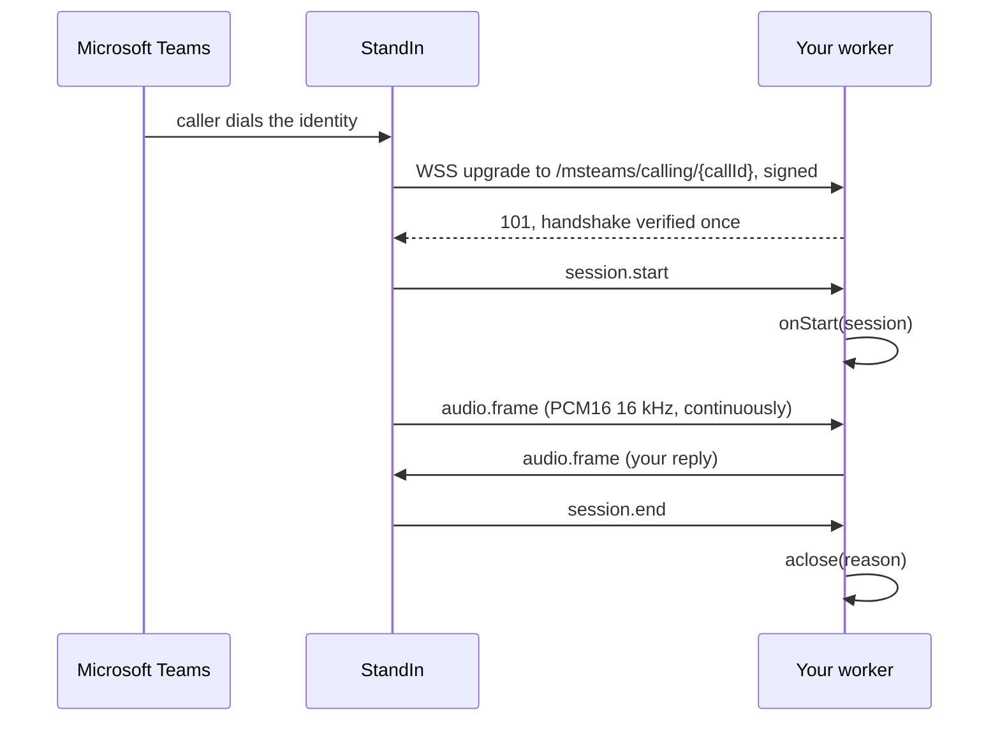

This page gets a Node.js worker answering a real Microsoft Teams call. It uses the echo plugin
first, on purpose: if the echo answers, your secret, your tunnel and your StandIn identity are all
correct, and anything that breaks afterwards is your agent rather than the transport.

## Prerequisites

- Node.js 20 or newer
- A StandIn identity and its connection secret, from [standin.komaa.com](https://standin.komaa.com)
- A way to expose one port over HTTPS: a tunnel on your laptop, or an ingress in a cluster

<Steps>

<Step title="Install the SDK">

```bash
npm install @komaa/standin-sdk
```

One package. The echo plugin and the `standin-echo` command come with it.

</Step>

<Step title="Run the echo worker">

```bash
STANDIN_SECRET="your-StandIn-connection-secret" \
STANDIN_HOST="127.0.0.1" \
npx standin-echo
```

One line tells you the listener is up:

```text
standin: answering Microsoft Teams calls on 127.0.0.1:9442/msteams/calling
```

`STANDIN_HOST=127.0.0.1` binds to loopback because a tunnel is the only thing that needs to reach it
on a laptop. In a container behind an ingress, leave it unset and the default `0.0.0.0` applies. The
upgrade is HMAC-authenticated either way.

</Step>

<Step title="Expose port 9442">

StandIn dials `wss://<your-host>/msteams/calling/{callId}`, so the public URL must terminate TLS and
forward WebSocket upgrades on that path. The path has to match, because that is where the per-call
`callId` segment is appended.

[Expose your agent](/expose#mount-the-call-path) has the mount command for Tailscale Funnel, ngrok,
cloudflared and devtunnel, and the probes that tell a registered mount from a working one. It is the
only page that carries those commands, because three divergent spellings of one URL across three
pages is what caused a live incident here.

<Warning>
Expose only that path. Anyone who reaches the port still needs a valid signature inside the freshness
window, so this is defence in depth rather than the authentication itself, but there is no reason to
publish more surface than one route.
</Warning>

</Step>

<Step title="Register the URL and call">

In the StandIn portal, set the identity's agent voice URL to the public `wss://` URL including the
`/msteams/calling` path. Then call the identity from Microsoft Teams and talk. You should hear yourself.

</Step>

</Steps>

## What just happened



## Replace the echo with your agent

The echo plugin is about 70 lines, and the shape of it is the shape of every plugin. Copy
it and change `onCallerAudio`:

```ts
import { CallServer, type CallSession } from "@komaa/standin-sdk";

class MyHandler {
  #call: CallSession | undefined;

  async onStart(session: CallSession) {
    this.#call = session;
    // Join a room, open a realtime socket, build an agent. Caller audio does not
    // flow until this resolves, so a slow start delays the caller instead of
    // dropping frames.
  }

  async onCallerAudio(pcm: Buffer) {
    // PCM16, 16 kHz, mono, little-endian. Hand it to your agent.
    const reply = await myFramework.respond(pcm);
    await this.#call?.sendAudio(reply);
  }

  async onGoodbye(text: string) {
    // StandIn is ending the call and wants this line spoken first.
  }

  async aclose(reason: string) {
    // Always called exactly once, on every path.
  }
}

const server = new CallServer({ handlerFactory: () => new MyHandler() });
await server.start();
```

If your agent speaks at 24 kHz, which every realtime speech-to-speech model does, do not write your
own resampler. Read [Audio](/typescript-sdk/audio) first: the SDK ships the resampler and the frame
aligner because getting the frame boundary wrong clips the end of every turn.

## Configuration

Everything reads from the environment, and `CallServerOptions` overrides any of it in code.

| Variable | Default | Meaning |
|---|---|---|
| `STANDIN_SECRET` | none, required | The connection secret from the portal. Without it the server refuses to construct. |
| `STANDIN_PORT` | `9442` | Port the call listener binds. |
| `STANDIN_HOST` | `0.0.0.0` | Bind address. |
| `STANDIN_WS_PATH` | `/msteams/calling` | Path StandIn dials. |
| `STANDIN_CHAT_URL` | `wss://teams.standin.komaa.com/api/chat/channel` | The [chat lane](/typescript-sdk/chat) endpoint. |
| `STANDIN_CHAT_SECRET` | unset, then `STANDIN_SECRET` | The key the chat lane signs with, read **before** `STANDIN_SECRET`. Set it only when your deployment was issued a separate chat credential. |

That is the set a first worker needs. [Configuration](/typescript-sdk/configuration) lists every
variable the SDK reads and what reads it.

## When it does not answer

| Symptom | Cause |
|---|---|
| The process exits at startup naming the secret | `STANDIN_SECRET` is unset. `CallServer` throws rather than start unauthenticated. |
| StandIn reports 401 | The secret does not byte-match the portal value, or the worker clock is more than 60 seconds off. |
| StandIn reports 404 | The public URL is missing the `/msteams/calling` path segment. |
| StandIn reports 503 | The worker is draining, or at `maxConnections`. |
| `401 handshake already used` | A correctly signed upgrade was replayed. The single-use guard is doing its job. |
| `409 call already has a live session` | A previous call for that `callId` has not finished tearing down, or a retry arrived while the first socket was still open. |
| The call connects and ends after 10 seconds | `session.start` never arrived. The pre-start watchdog closed it. |
| The call ends after two minutes with `no-agent-answered` | The handler never sent audio and never called `session.markAnswered()`. The usual cause is an agent dispatch that never landed: the socket, the signature and `onStart` were all fine, and nothing arrived to take the call. |
| The call ends mid-conversation with `caller-idle-timeout` | No caller audio for 45 seconds. A live call always sends frames, so the far side is gone. |

`GET /healthz` on the same port returns `{"ok": true, "calls": <n>}`, which is the cheapest way to
confirm the listener is really bound. To go further without placing a call at all, see
[Checking the install](/typescript-sdk/checking-the-install).

## Next

<CardGroup cols={2}>
  <Card title="Call handler" icon="plug" href="/typescript-sdk/call-handler">
    The seven methods, the session object, and how to refuse a call.
  </Card>
  <Card title="Copy the echo plugin" icon="circle-play" href="/typescript-sdk/plugins/echo">
    The template, and how to turn it into your own plugin.
  </Card>
  <Card title="Audio" icon="waveform" href="/typescript-sdk/audio">
    What to do when your agent speaks at 24 kHz.
  </Card>
  <Card title="Security" icon="shield" href="/typescript-sdk/security">
    Why a drifting clock turns every call into a 401.
  </Card>
</CardGroup>
